# Microsoft Fabric - Fabric Analyst in a Day - Laboratório 3


# Sumário

- Introdução
- Atalho para o ADLS Gen2
  - Tarefa 1: Criar um atalho
- Transformar dados usando uma consulta Visual
  - Tarefa 2: Criar exibição Geo usando uma consulta Visual
  - Tarefa 3: Criar exibição Reseller usando uma consulta Visual
  - Tarefa 4: Criar a exibição Sales usando uma consulta Visual
  - Tarefa 5: Criar exibição Product usando uma consulta Visual
- Referências

# Introdução 

Em nosso cenário, os Dados de Venda são obtidos do sistema ERP e
armazenados em um ADLS Gen2. Eles são atualizados ao meio-dia/12h, todos
os dias. Precisamos transformar e ingerir esses dados no Lakehouse e
usá-los em nosso modelo.

Há várias maneiras de ingerir esses dados.

- **Atalhos:** cria um link com os dados e podemos usar modos de
    exibição de consulta Visual para transformá-los. Usaremos os Atalhos
    neste laboratório.

- **Notebooks:** isso exige que escrevamos código. É uma abordagem
    para desenvolvedores.

- **Fluxo de Dados Gen2:** você provavelmente conhece o Power Query ou
    o Fluxo de Dados Gen1. O Fluxo de Dados Gen2, como o nome indica, é
    a versão mais recente do Fluxo de Dados. Ele oferece todos os
    recursos do Power Query/Fluxo de Dados Gen1 com o recurso adicional
    de transformar e ingerir dados em diversas fontes de dados.
    Apresentaremos isso nos próximos laboratórios.

- **Pipeline de Dados:** é uma ferramenta de orquestração. As
    atividades podem ser orquestradas para extrair, transformar e
    ingerir dados. Usaremos o Pipeline de Dados para executar a
    atividade do Fluxo de Dados Gen2 que, por sua vez, realizará a
    extração, a transformação e a ingestão.

Começaremos criando um atalho para ingerir dados em um Lakehouse da
fonte de dados ADLS Gen2. Uma vez ingeridos, usaremos modos de exibição
de consulta Visual para transformá-los.

Ao final deste laboratório, você terá aprendido a:

- Como criar atalhos no Lakehouse

- Como transformar dados usando um recurso de consulta Visual

## Atalho para o ADLS Gen2

### Tarefa 1: Criar um atalho

Os atalhos são usados para criar um link com o local de destino. Os
atalhos fornecem acesso aos dados sem a necessidade de mover fisicamente
os dados para o lakehouse. É como criar atalhos na área de trabalho do
Windows.

1. Vamos voltar ao **espaço de trabalho do Fabric** **(1)** que você
    criou no Laboratório 2, Tarefa 8.

2. Se você não saiu do laboratório anterior, estará na tela Lakehouse.
    Caso contrário, não tem problema. Selecione **lh_FAIAD** (**2)**
    para acessar o Lakehouse.

3. No painel **Explorer**, selecione as **reticências (3)** ao lado de
    **Tables**.

4. Selecione **Novo atalho (4)**.

   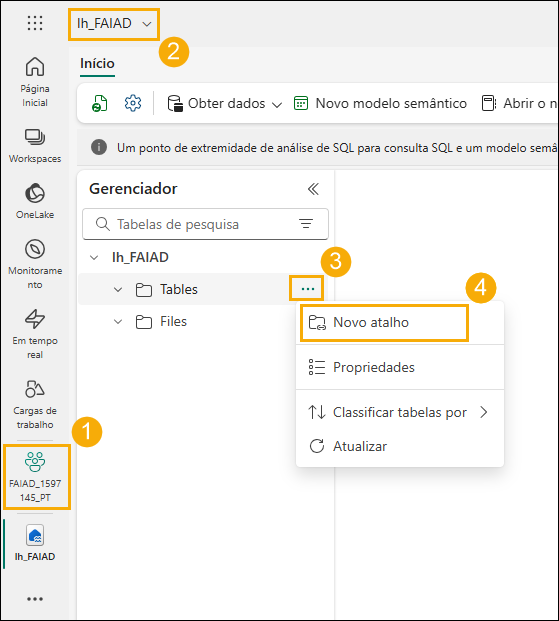

5. A caixa de diálogo **Novo atalho** é aberta. Em **Fontes externas**,
    selecione **Azure Data Lake Storage Gen2**.

   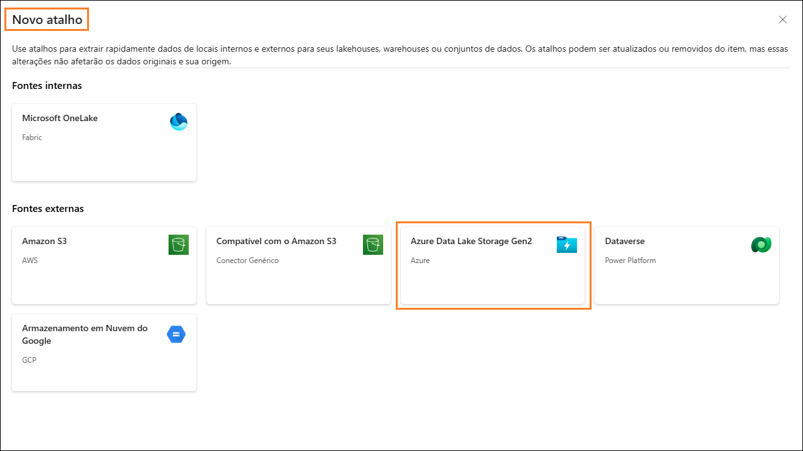

6. Selecione **Criar nova conexão (1)**.

7. Insira o seguinte link para a propriedade **URL**:
    <https://stvnextblobstorage.dfs.core.windows.net/fabrikam-sales>
    **(2):**

8. Clique em Criar Nova Conexão (3) na seção Conexão

9. Selecione **Assinatura de Acesso Compartilhado (SAS) (4)** no menu
    suspenso Tipo de autenticação.

10. Copie o token SAS e cole-o no campo Token SAS (5).

    - **Token SAS:**

11. Selecione **Avançar (6)** na parte inferior direita da tela.

    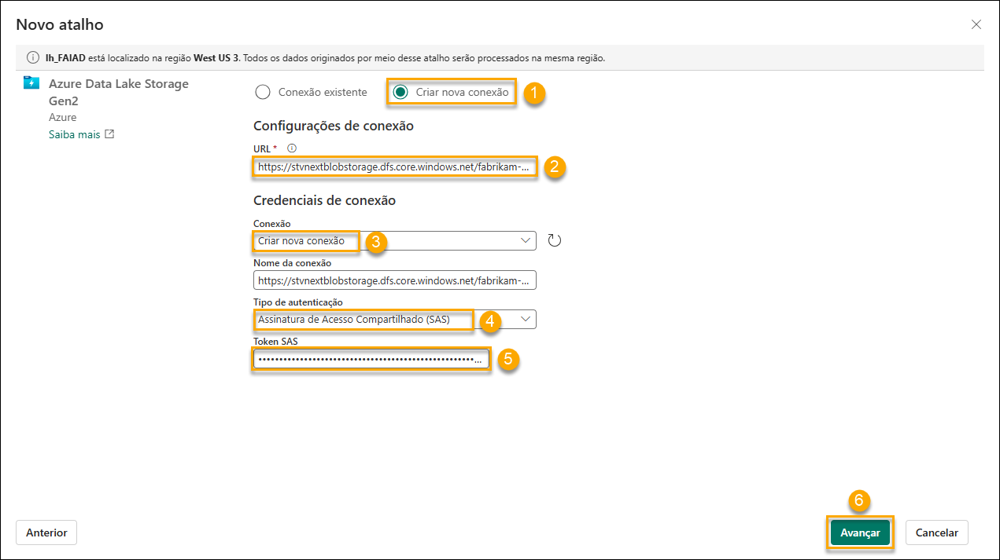

12. Você será conectado ao ADLS Gen2 com a estrutura de diretórios
    exibida no painel esquerdo. Expanda **Delta-Parquet-Format-FY25
    (1)**.

13. **Selecione** os seguintes diretórios **(2)** e clique em **Avançar
    (3)**:

    a. Application.Cities

    b. Application.Countries

    c. Application.StateProvinces

    d. DateDim

    e. Sales.BuyingGroups

    f. Sales.Customers

    g. Sales.InvoiceLines

    h. Sales.Invoices

    i. Warehouse.StockGroups

    j. Warehouse.StockItemStockGroups

    k. Warehouse.StockItems

    **Observação:** Sales.Invoices_May é o único diretório que **não está**
selecionado.

    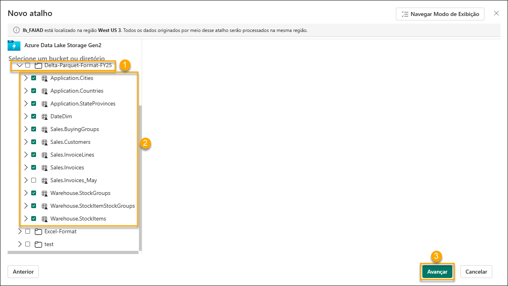

14. Você irá para a próxima caixa de diálogo para editar os nomes.
    Selecione o **ícone Editar (1)**, em Ações, para
    **Application.Cities**.

15. Renomeie **Application.Cities para Cities (2)**.

16. Marque a caixa de seleção ao lado do nome para salvar a alteração
    **(3)**.

    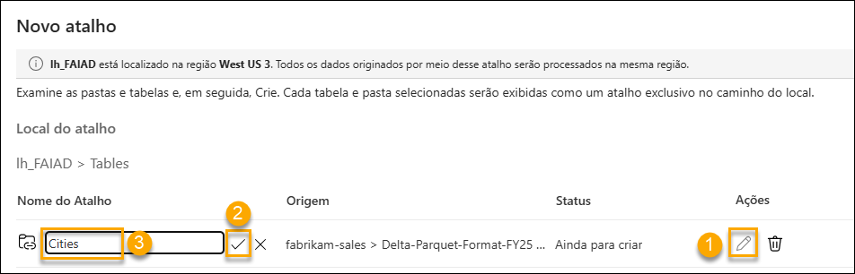

17. Da mesma forma, renomeie os nomes de atalhos como abaixo:

    a. Application.Countries para **Countries**

    b. Application.StateProvinces para **States**

    c. DateDim para **Date**

    d. Sales.BuyingGroups para **BuyingGroups**

    e. Sales.Customers para **Customers**

    f. Sales.InvoiceLines para **InvoiceLineItems**

    g. Sales.Invoices para **Invoices**

    h. Warehouse.StockGroups para **ProductGroups**

    i. Warehouse.StockItemStockGroups para **ProductItemGroup**

    j. Warehouse.StockItems para **ProductItem**

    > **Observação**: confira novamente os nomes. Um erro de digitação pode
    > causar erros durante o laboratório.

18. Selecione **Criar** para criar o atalho.

    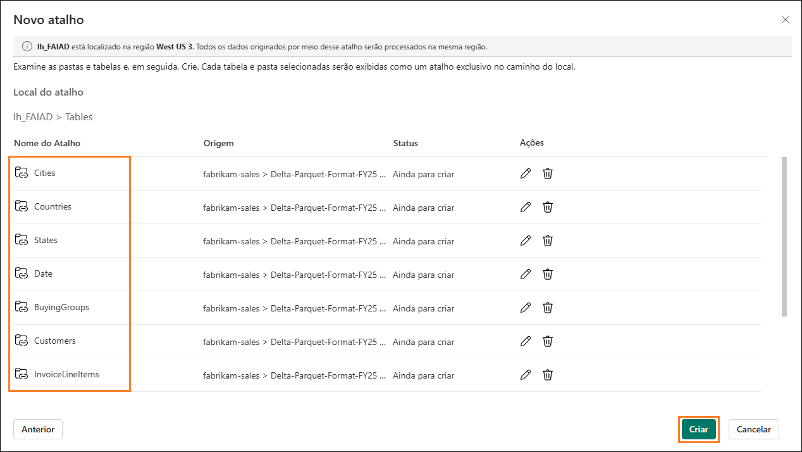

19. Observe que todos os atalhos são criados como tabelas. Selecione a
    tabela **BuyingGroups** e observe que podemos ver uma prévia dos
    dados no painel de dados.

    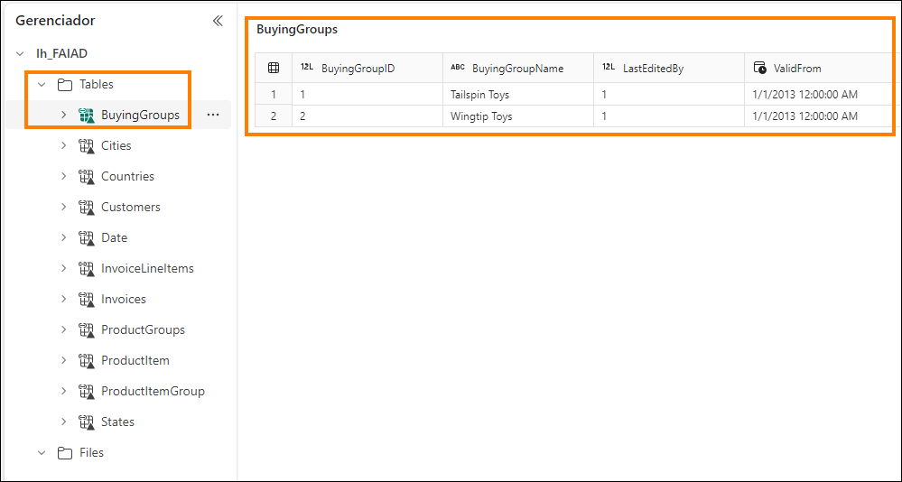

A próxima etapa é transformar os dados, para que possamos criar um
modelo semântico. Vamos criar exibições para transformar os dados.

# Transformar dados usando uma consulta Visual

### Tarefa 2: Criar exibição Geo usando uma consulta Visual

1. Podemos acessar o lakehouse usando um ponto de extremidade SQL. Isso
    possibilita consultar os dados e criar exibições. No **canto
    superior direito** da tela, selecione **Lakehouse (1) -> Ponto
    de extremidade de análise de SQL (2)**.

    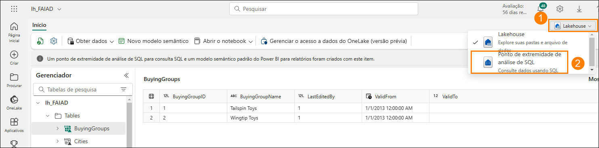

    Você irá para o ponto de extremidade de análise de SQL. Observe que o
    painel Explorer foi alterado. Agora você pode criar exibições,
    procedimentos armazenados, consultas e muito mais. Vamos criar uma
    consulta visual, pois ela fornece um low-code, semelhante à interface do
    Power Query. Vamos salvar o resultado como uma exibição.
    
    Começaremos criando uma exibição Geo. Precisamos mesclar dados das
    tabelas Cities, States e Countries para criar a exibição Geo.

2. No menu superior, clique no menu suspenso ao lado de **Nova consulta
    SQL (1)** e depois selecione **Nova consulta visual (2)**.

    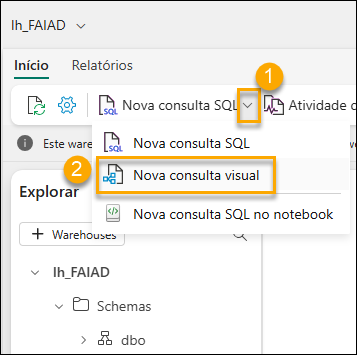

3. Para criar uma consulta, precisamos adicionar tabelas ao painel
    Consulta Visual. Clique nas reticências ao lado da tabela **Cities
    (1)** e selecione **Inserir na tela (2).**

    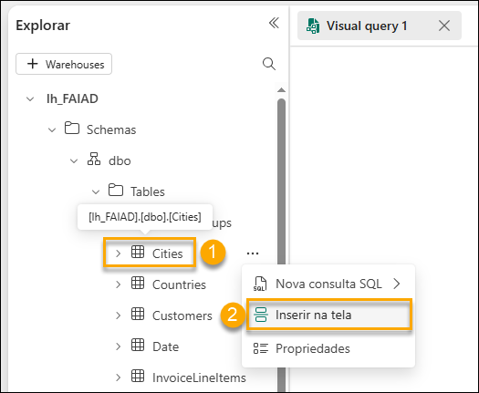

4. Repita as mesmas etapas para as tabelas **States** e **Countries**.

   Em seguida, precisamos mesclar essas consultas. O editor de consultas
visuais vem com a opção de usar o Editor do Power Query. Vamos usar
isso, já que estamos familiarizados.

5. No menu do Editor de consultas visuais, selecione o ícone **Abrir em
    popup** (à direita). Você irá para o Editor do Power Query.

   - ***Observação:** Talvez seja necessário rolar para a direita ou reabrir
a guia de consulta de visual se você não vir imediatamente esse ícone.*

   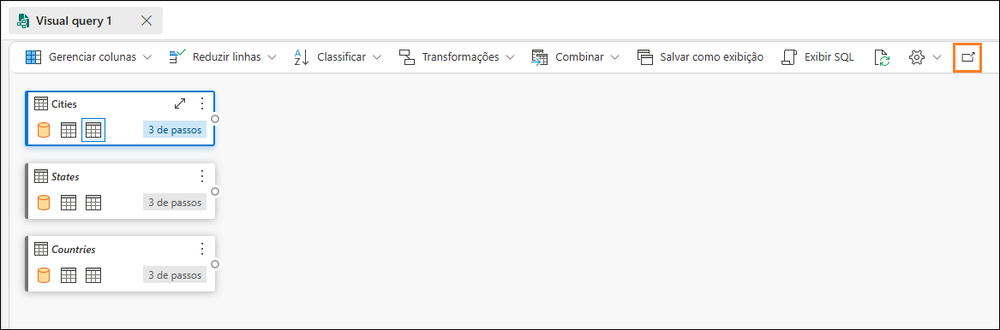

6. Com a consulta **Cities(1)** selecionada, na faixa de opções do
    Editor do Power Query, selecione **Página Inicial (2) ->
    Combinar (3) -> menu suspenso Mesclar consultas (4) -> Mesclar
    consultas como novas (5).** A caixa de diálogo Mesclar consultas é
    aberta.

    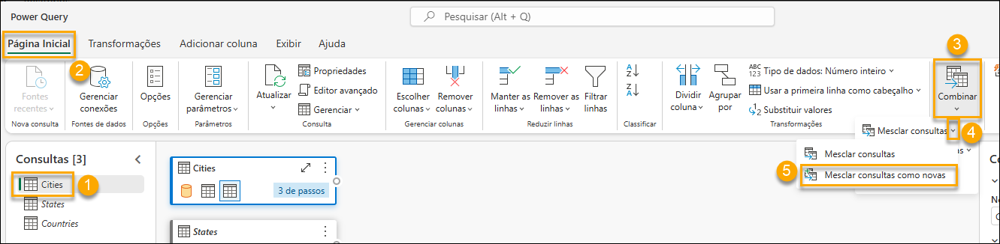

7. Na **Tabela esquerda para mesclagem**, selecione **Cities**.

8. Na **Tabela direita para mesclagem**, selecione **States**.

9. Selecione as colunas **StateProvinceID** das duas tabelas. Vamos
    usar esta coluna.

10. Selecione **Interna** como o **Tipo de junção**.

11. Selecione **OK.**

    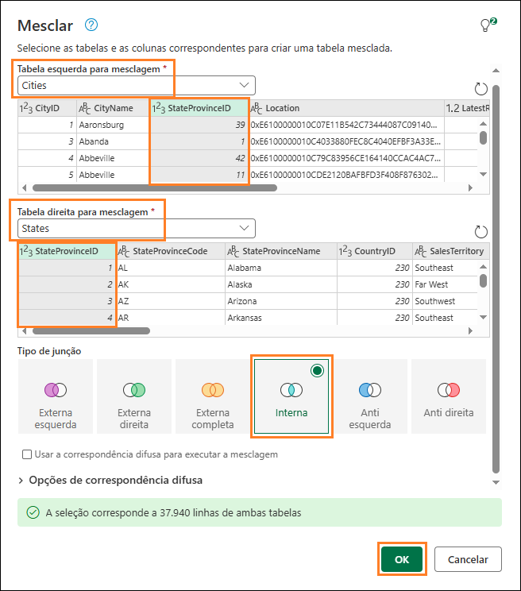

     Observe que uma nova consulta chamada **Merge** foi criada. Precisamos
de algumas colunas de States.

12. Na **exibição Dados** (painel inferior), clique na **seta dupla** ao
    lado da coluna **States** (última coluna à direita).

13. Um painel é aberto. **Selecione** as colunas a seguir:

    a. StateProvinceCode

    b. StateProvinceName

    c. CountryID

    d. SalesTerritory

14. Selecione **OK**.
 
    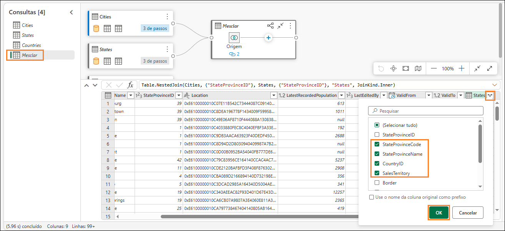

     Precisamos mesclar a consulta Countries agora.

15. Com a consulta Merge selecionada (1), selecione **Página Inicial (2)
    -> Combinar (3) -> menu suspenso Mesclar consultas (4) -> Mesclar
    consultas (5)**.

    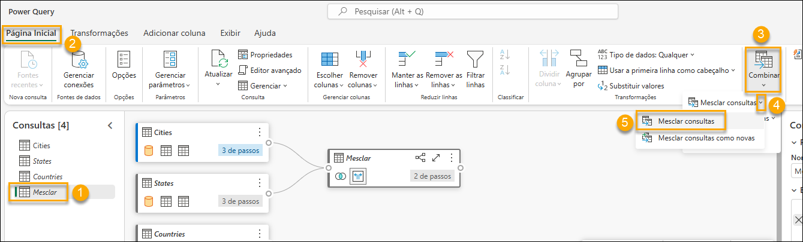

16. A caixa de diálogo Mesclar é aberta. Na **Tabela direita para
    mesclagem**, selecione **Countries**.

17. Selecione as colunas **CountryID** das duas tabelas. Vamos usar esta
    coluna.

18. Selecione **Interna** como o **Tipo de junção**.

19. Selecione **OK.**

    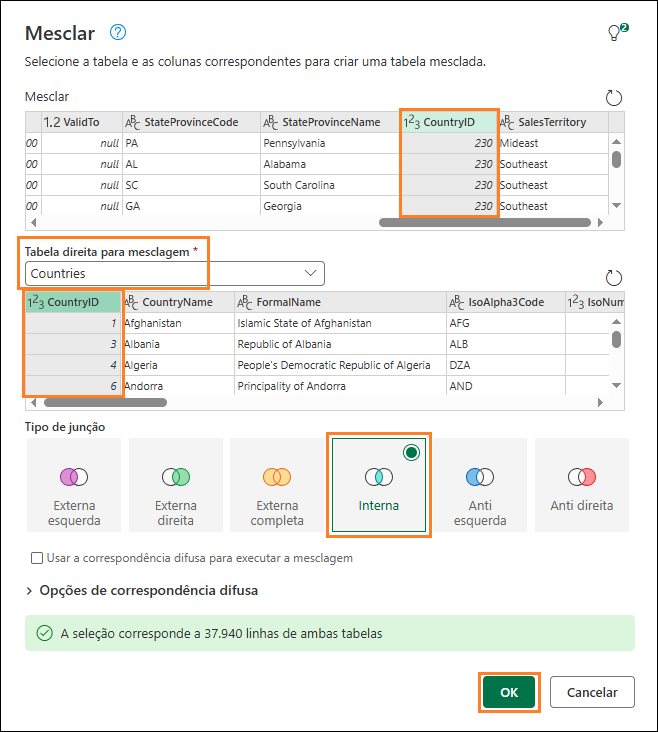

    Precisamos de algumas colunas de Countries.

20. Na **exibição Dados** (painel inferior), clique na **seta dupla** ao
    lado da coluna **Countries**.

21. Um painel é aberto. **Selecione** as colunas a seguir:

    a. CountryName

    b. FormalName

    c. IsoAlpha3Code

    d. IsoNumericCode

    e. CountryType

    f. Continent

    g. Region

    h. Subregion

22. Selecione **OK**.

     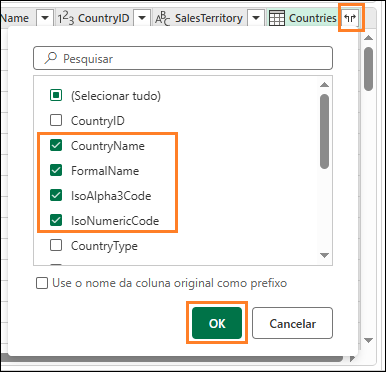

      Não precisamos de todas as colunas na tabela **Merge**. Certifique-se de
selecionar apenas as colunas que precisamos.

23. Com a consulta **Merge** selecionada (1), selecione **Página
    Inicial (2) -> Escolher colunas (3) -> Escolher colunas (4)** na
    faixa de opções.

    > **Observação:** se a opção Escolher colunas não estiver visível, você
    > poderá encontrá-la em Gerenciar colunas.

    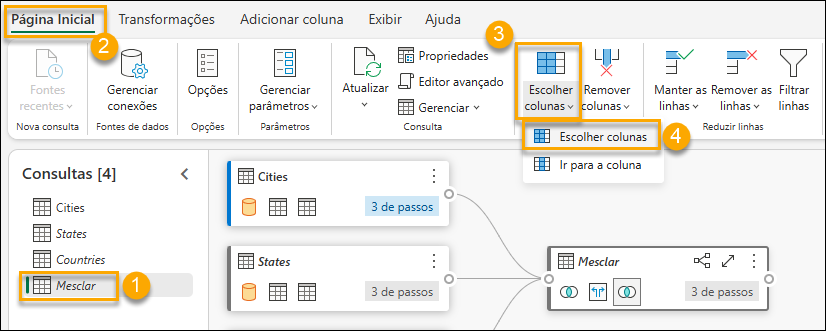

24. A caixa de diálogo Escolher colunas é aberta. **Desmarque** as
    colunas a seguir.

    a. StateProvinceID

    b. Location

    c. LastEditedBy

    d. ValidFrom

    e. ValidTo

    f. CountryID

25. Selecione **OK**.

     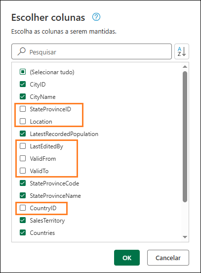

     Observe que o processo é como o Power Query. Temos todas as etapas
gravadas tanto no painel Etapas Aplicadas à direita quanto na exibição
visual. Vamos renomear a consulta Merge e Habilitar carga, para que os
dados sejam carregados a partir dessa consulta.

26. **Clique com o botão direito do mouse** na consulta **Merge** no
    painel Consultas (à esquerda). Selecione **Renomear** e renomeie a
    consulta para **Geo**.

27. **Clique com o botão direito do mouse** na consulta **Geo** no
    painel Consultas (à esquerda). Selecione **Habilitar carga** para
    habilitar essa consulta.

28. Verifique se as consultas Cities, States e Countries estão
    **desabilitadas**.

29. Selecione **Salvar** encontrado no canto inferior direito do Editor
    do Power Query.

    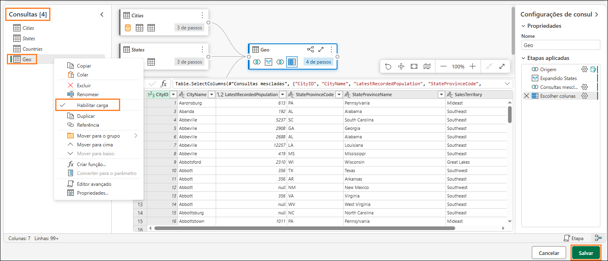

    Navegaremos até o Editor de consulta de visual. Agora vamos salvar essa
consulta como uma exibição.

    **Observação**: todas as etapas que executamos usando o editor do Power
Query podem ser executadas usando o editor de consulta Visual também.

30. No menu Editor de consultas Visual, selecione **Salvar como
    exibição**.

    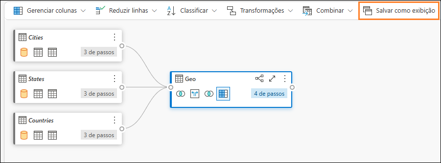

    A caixa de diálogo Salvar como exibição é aberta. Observe que a consulta
SQL está disponível. Você pode revisá-la, se quiser revisar o código
SQL.

31. Insira **Geo** como **Nome da exibição**.

32. Selecione **OK** para salvar a exibição.

    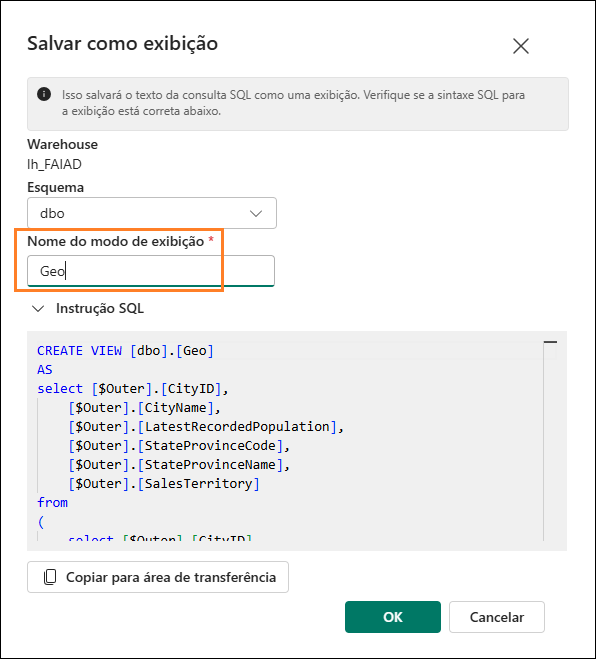

    Você receberá um alerta assim que a exibição for salva.

33. No painel Explorer (à esquerda), expanda **Views.** Temos a exibição
    recém-criada Geo.

    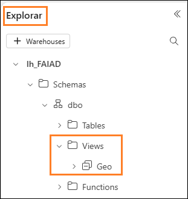

### Tarefa 3: Criar exibição Reseller usando uma consulta Visual

Vamos criar a exibição Reseller, mesclando a tabela Customers com a
tabela BuyingGroups. Desta vez, criaremos a exibição usando a consulta
Visual sem abrir a opção Power Query.

1. No menu superior, clique no menu suspenso ao lado de **Nova consulta
    SQL (1)** e depois selecione **Nova consulta visual (2)**.

2. Para criar uma consulta, precisamos adicionar tabelas ao painel
    Consulta Visual. Clique nas reticências ao lado da tabela
    **BuyingGroups (1)** e selecione **Inserir na tela (2)**.

    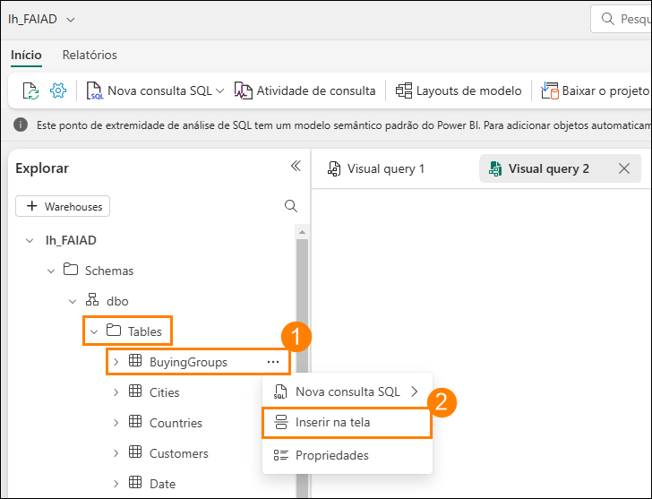

3. Repita as mesmas etapas para a tabela **Customers**.

4. **Selecione a consulta Customers**. Quando selecionada, Customers
    terá um sinal de "**+**" depois da Tabela (isso indica que estamos
    adicionando uma etapa depois da Tabela. Se você não vir o sinal de
    "**+**" depois da tabela, talvez tenha selecionado uma etapa
    diferente. Selecione Table e pronto.)

<!-- -->

5. No menu Consulta de Visual, selecione **Combinar -> Mesclar
    consultas**.

   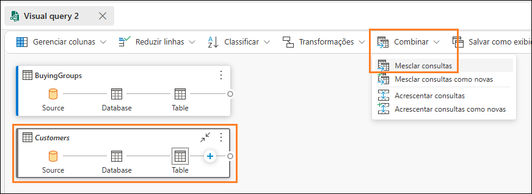

   A caixa de diálogo Mesclar é aberta com Customers selecionada como a
tabela superior.

6. Na **Tabela direita para mesclagem**, selecione **BuyingGroups**.

7. Selecione as colunas **BuyingGroupID** das duas tabelas. Vamos usar
    esta coluna.

8. Selecione **Interna** como o **Tipo de junção**.

9. Selecione **OK.**

    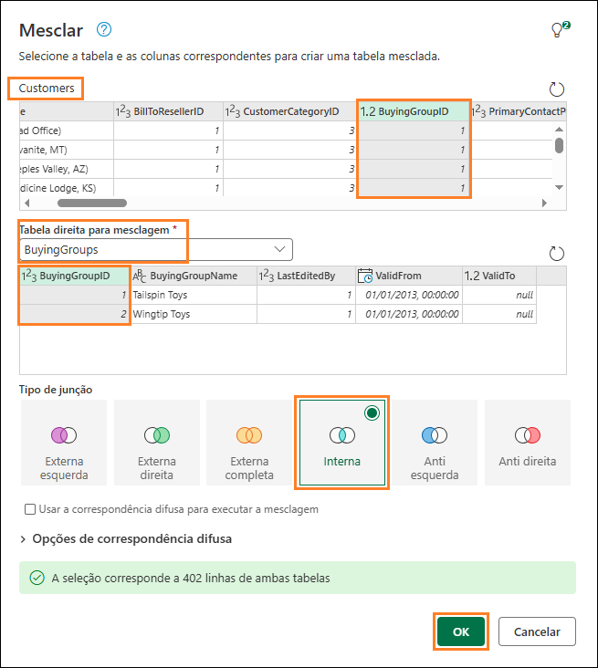

10. Na **exibição Dados** (painel inferior), clique na **seta dupla** ao
    lado da coluna **BuyingGroups** (última coluna à direita) para
    selecionar as colunas que precisamos de BuyingGroups.

11. Um painel é aberto. Selecione a coluna **BuyingGroupName**.

12. Selecione **OK**.

    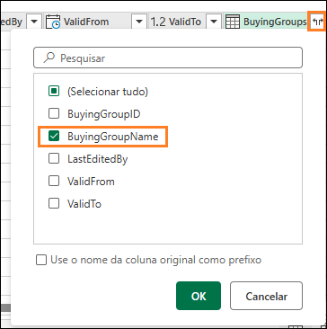

    Não precisamos de todas as colunas na tabela Customer. Vamos selecionar
apenas aquelas de que precisamos.

13. No menu de consulta de Visual, selecione **Gerenciar colunas ->
    Escolher colunas**.

    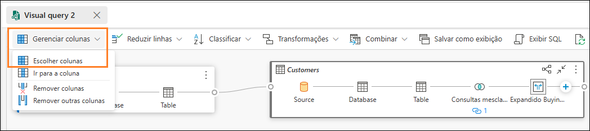

14. A caixa de diálogo Escolher colunas é aberta. **Selecione** as
    colunas a seguir.

    a. ResellerID

    b. ResellerName

    c. PostalCityID

    d. PhoneNumber

    e. FaxNumber

    f. WebsiteURL

    g. DeliveryAddressLine1

    h. DeliveryAddressLine2

    i. DeliveryPostalCode

    j. PostalAddressLine1

    k. PostalAddressLine2

    l. PostalPostalCode

    m. BuyingGroupName

15. Selecione **OK**.

    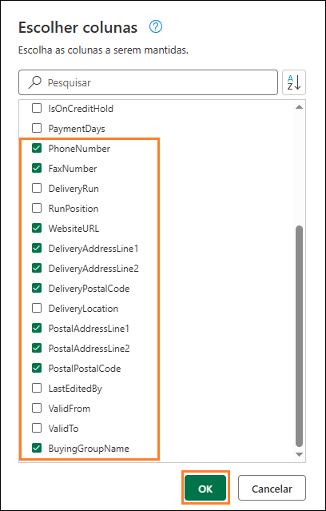
   
16. Vamos renomear a coluna BuyingGroupName. Na **exibição Dados, clique
    duas vezes no cabeçalho da coluna BuyingGroupName** para torná-lo
    editável.

17. **Renomeie** a coluna como **ResellerCompany**.

     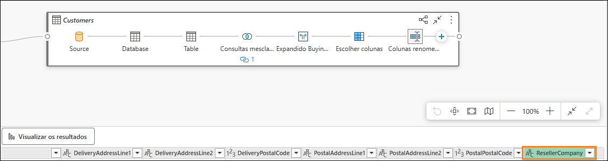

     Observe que a tabela Customer tem todas as etapas documentadas. Vamos
salvar esta exibição.

18. Precisamos salvar a consulta Customer, pois ela tem todas as etapas.
    Precisamos habilitar carga. Selecione as **reticências** na caixa de
    consulta **Customer**.

19. Verifique se a opção **Habilitar carga** está marcada.

    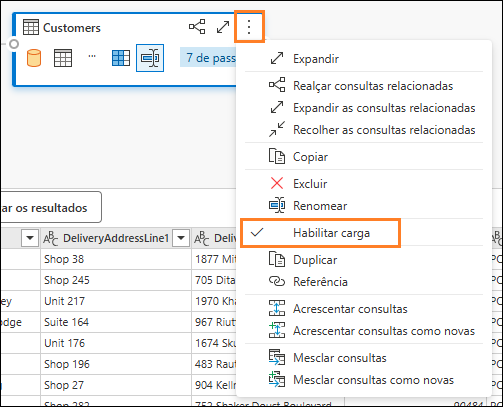

    - **Observação**: A caixa **Customer** deve ter uma borda azul se a opção
Habilitar carga estiver marcada.

20. No menu de consultas Visual, selecione **Salvar como exibição**.

    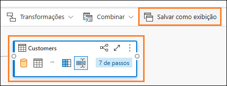

    A caixa de diálogo Salvar como exibição é aberta. Observe que a consulta
SQL está disponível. Você pode revê-la, se selecioná-la.

21. Insira **Reseller** como **Nome da exibição**.

22. Selecione **OK** para salvar a exibição.

    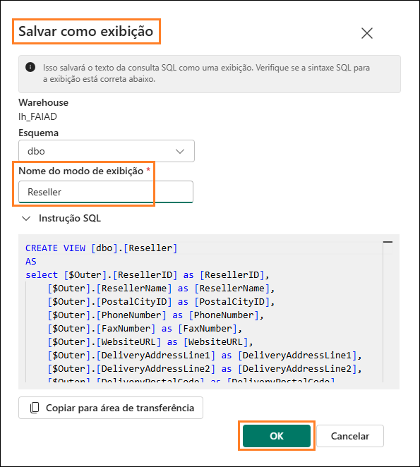

    Você receberá um alerta assim que a exibição for salva.

23. No painel Explorer (à esquerda), expanda **Views.** Temos a exibição
    recém-criada Reseller.

    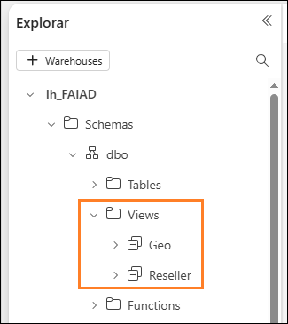

### Tarefa 4: Criar a exibição Sales usando uma consulta Visual

Vamos criar a exibição Sales, mesclando as tabelas InvoiceLineItems e
Invoices com a exibição Reseller. Temos essa consulta no Power BI
Desktop. Vamos copiar o código do Editor Avançado. Mas antes de copiar o
código, precisamos criar uma tabela de mesclagem usando a consulta
Visual, pois a criação de uma consulta em branco não é possível na
consulta Visual. Vamos testar esse método.

1. No menu superior, clique no menu suspenso ao lado de **Nova consulta
    SQL** e depois selecione **Nova consulta visual**.

    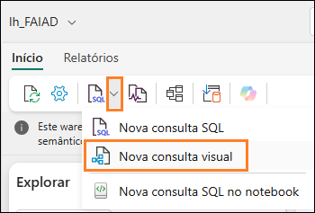

2. Na seção **Explorer -> Table**, precisamos adicionar as tabelas ao
    painel de Consulta Visual. Clique nas reticências ao lado da tabela
    **InvoiceLineItems** e selecione **Inserir na tela**.

3. Repita as mesmas etapas para a tabela **Invoices**.

4. Na seção **Explorer -> Views**, precisamos adicionar as tabelas ao
    painel de Consulta Visual. Clique nas reticências ao lado da tabela
    **Reseller** e selecione **Inserir na tela**.

5. No Editor de consulta Visual, selecione o ícone **Abrir em popup**
    para abrir o Editor do Power Query.

    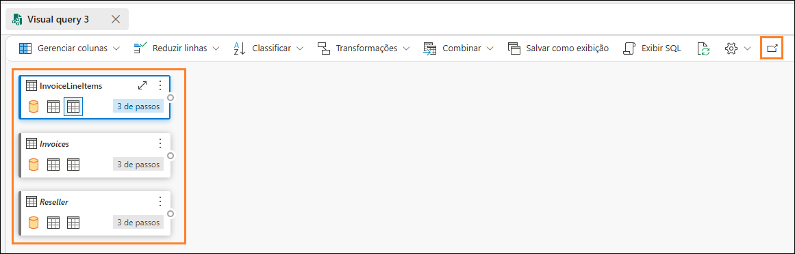

6. Com a consulta **InvoiceLineItems** selecionada, na faixa de opções,
    selecione **Página Inicial (2) -> Combinar (3) -> menu suspenso
    Mesclar consultas (4) -> Mesclar consultas como novas (5).**
    A caixa de diálogo Mesclar consultas é aberta.

    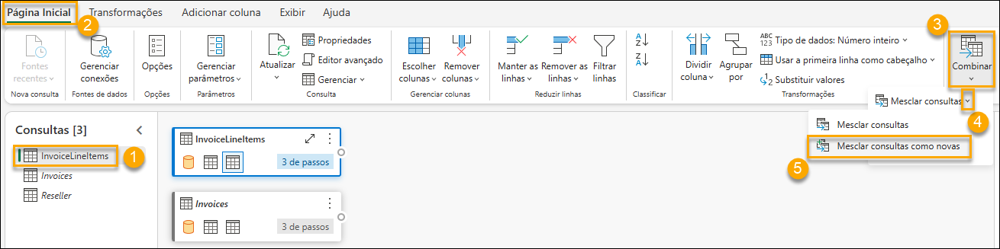

7. Na **Tabela esquerda para mesclagem**, selecione
    **InvoiceLineItems**.

8. Na **Tabela direita para mesclagem**, selecione **Invoices**.

9. Selecione as colunas **InvoiceID** das duas tabelas. Vamos usar esta
    coluna.

10. Selecione **Interna** como o **Tipo de junção**.

11. Selecione **OK.**

     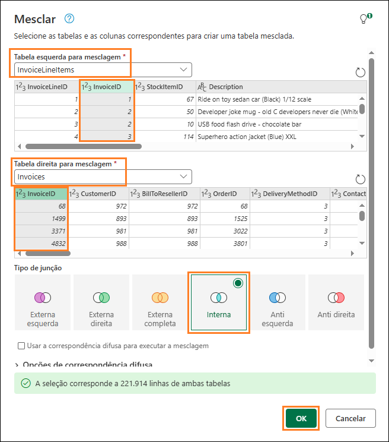

     Vamos copiar o código do Power BI Desktop e colá-lo usando o Editor
Avançado.

12. Se você ainda não tiver aberto, abra o arquivo **FAIAD.pbix** que
    está na pasta **Reports** na área de trabalho do seu ambiente de
    laboratório.

13. Na faixa de opções, selecione **Página Inicial -> Transformar
    dados**. A janela do Power Query é aberta. Como você observou no
    laboratório anterior, as consultas no painel esquerdo são
    organizadas por fonte de dados.

    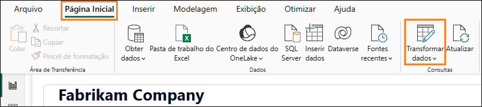

14. No painel esquerdo **Consultas**, na pasta **ADLSData** **(1)**,
    selecione a consulta **Sales (2).**

15. Na faixa de opções, selecione **Página Inicial -> Editor Avançado
    (3)**. A caixa de diálogo Editor Avançado é aberta.

    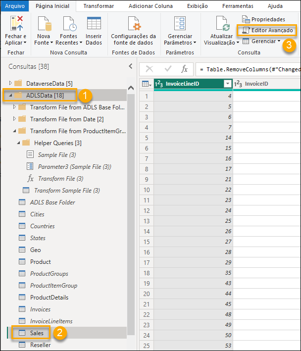

    - **Observação:** se você não conseguir encontrar o Editor Avançado,
poderá acessá-lo em **Início -> Consulta -> Editor Avançado**.

16. **Selecione código da Linha 3** (#"Expanded Invoice"...) até a
    última linha de código.

17. **Clique com o botão direito do mouse** e selecione **Copy**.

18. Selecione **Cancelar** para fechar o Editor Avançado.

     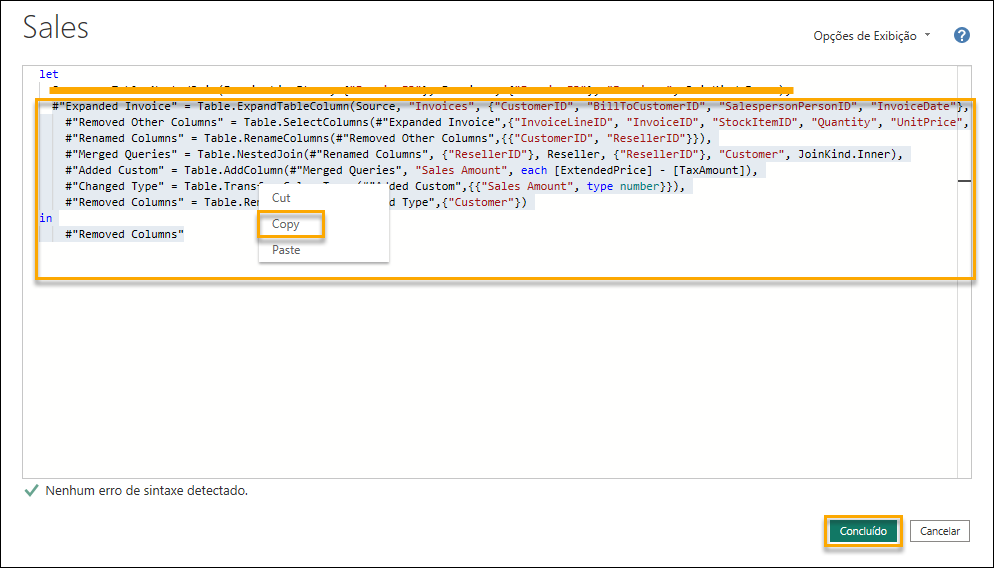

19. **Volte a acessar o navegador** onde o Editor do Power Query está
    aberto.

20. Verifique se você tem a consulta **Merge** selecionada.

21. Na faixa de opções, selecione **Página Inicial -> Editor
    Avançado**. A caixa de diálogo Editor Avançado é aberta.

     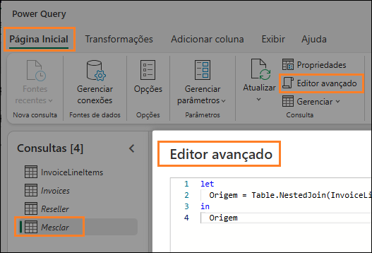

22. No **fim da linha 2, adicione uma vírgula** (Source =
    Table.NestedJoin(InvoiceLineItems, {"InvoiceID"}, Invoices,
    {"InvoiceID"}, "Invoices", JoinKind.Inner),

23. Pressione **Enter** para começar uma nova linha.

24. Digite **Ctrl+V** no teclado para colar o código copiado do Power BI
    Desktop.

    - **Observação**: se você estiver trabalhando no ambiente de laboratório,
selecione as **reticências(...)** no canto superior direito da tela. Use
o controle deslizante para **habilitar** **Área de Transferência Nativa
da VM**. Selecione OK na caixa de diálogo. Depois que terminar de colar
as consultas, você poderá desabilitar essa opção.

    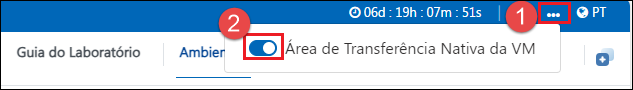

    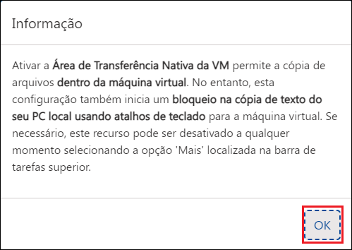

25. Realce as duas últimas linhas de código (na Origem) e **exclua-o**.

26. Selecione **OK** para salvar as alterações.

    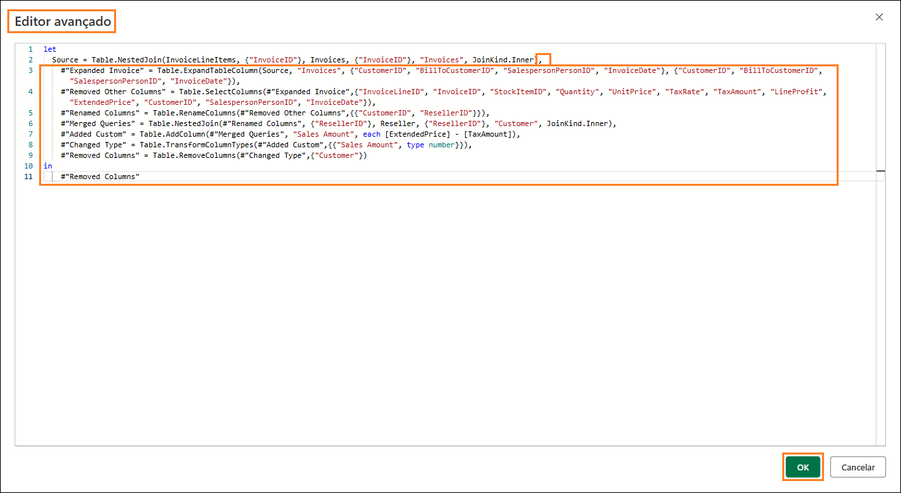

   - Se for mais fácil, exclua todo o código no Editor Avançado e cole o
código abaixo.

      ```
      let
        Source = Table.NestedJoin(InvoiceLineItems, {"InvoiceID"}, Invoices, {"InvoiceID"}, "Invoices", JoinKind.Inner),
          #"Expanded Invoice" = Table.ExpandTableColumn(Source, "Invoices", {"CustomerID", "BillToCustomerID", "SalespersonPersonID", "InvoiceDate"}, {"CustomerID", "BillToCustomerID", "SalespersonPersonID", "InvoiceDate"}),
          #"Removed Other Columns" = Table.SelectColumns(#"Expanded Invoice",{"InvoiceLineID", "InvoiceID", "StockItemID", "Quantity", "UnitPrice", "TaxRate", "TaxAmount", "LineProfit", "ExtendedPrice", "CustomerID", "SalespersonPersonID", "InvoiceDate"}),
          #"Renamed Columns" = Table.RenameColumns(#"Removed Other Columns",{{"CustomerID", "ResellerID"}}),
          #"Merged Queries" = Table.NestedJoin(#"Renamed Columns", {"ResellerID"}, Reseller, {"ResellerID"}, "Customer", JoinKind.Inner),
          #"Added Custom" = Table.AddColumn(#"Merged Queries", "Sales Amount", each [ExtendedPrice] - [TaxAmount]),
          #"Changed Type" = Table.TransformColumnTypes(#"Added Custom",{{"Sales Amount", type number}}),
          #"Removed Columns" = Table.RemoveColumns(#"Changed Type",{"Customer"})
      in
          #"Removed Columns"
      ```

27. Você voltará para o Editor do Power Query. À esquerda, no painel
    Consultas, **clique duas vezes na consulta Merge** para renomeá-la.

28. **Renomeie** a consulta Merge para **Sales**.

29. Clique com o botão direito do mouse na consulta Sales e selecione
    **Habilitar carga** para permitir que a consulta seja carregada.

     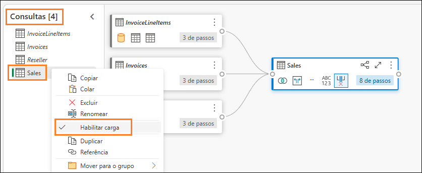

30. Selecione **Salvar** para salvar e fechar a caixa de diálogo Power
    Query. Você navegará até o Editor de consulta de visual.

31. No menu de consultas Visual, selecione **Salvar como exibição**. A
    caixa de diálogo Salvar como exibição é aberta. Observe que a
    consulta SQL está disponível. Você pode revisá-lo, se quiser.

32. Insira **Sales** como **Nome da exibição (1)**.

33. Selecione **OK (2)** para salvar a exibição.

     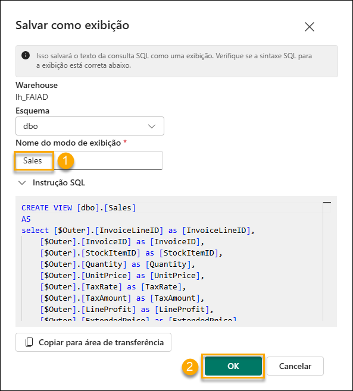

     Você receberá um alerta assim que a exibição for salva.

34. No painel Explorer (à esquerda), expanda **Views.** Temos a exibição
    recém-criada Sales.

    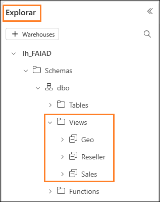

### Tarefa 5: Criar exibição Product usando uma consulta Visual

Vamos criar a exibição Product, mesclando as tabelas **ProductItem**,
**ProductItemGroup** e **ProductGroups**. Para continuar, vamos copiar o
código no Editor Avançado.

1. No menu superior, clique no menu suspenso ao lado de **Nova consulta
    SQL (1)** e depois selecione **Nova consulta visual (2)**.

    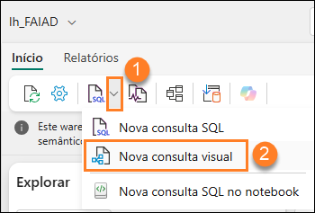

2. Na seção Explorer, precisamos adicionar as tabelas ao painel de
    Consulta Visual. Clique nas reticências ao lado da tabela
    **ProductItem (1)** e selecione **Inserir na tela (2)**.

    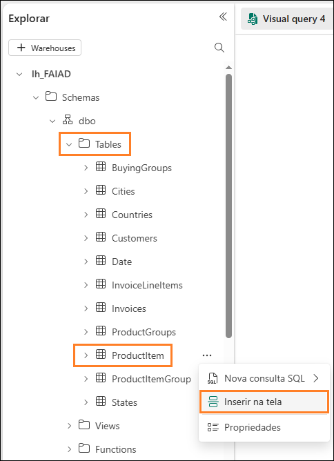

3. Repita as mesmas etapas para as tabelas **ProductItemGroup** e
    **ProductGroups**.

4. No Editor de consulta Visual, selecione o **ícone Modo de foco**
    para abrir o Editor do Power Query.

   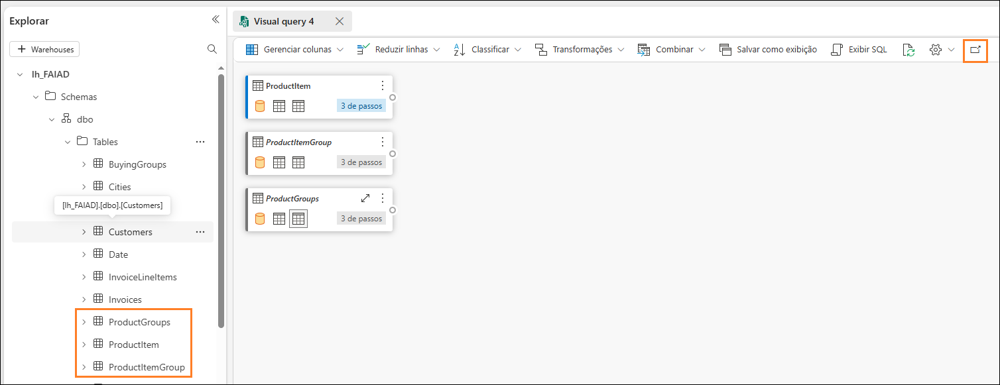

5. Com a consulta **ProductItem** selecionada **(1)**, na faixa de
    opções, selecione **Página Inicial (2) -> Combinar (3) -> menu
    suspenso Mesclar consultas (4) -> Mesclar consultas como novas
    (5).** A caixa de diálogo Mesclar é aberta.

    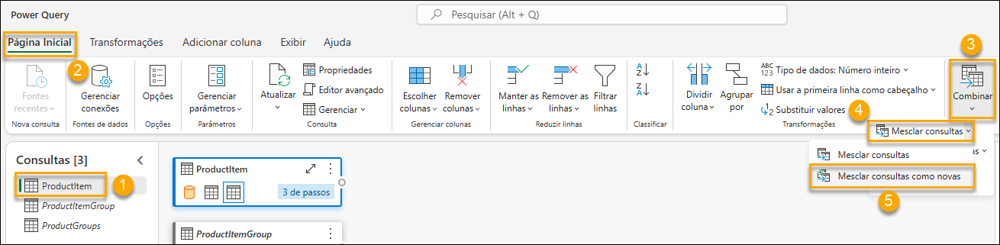

6. Na **Tabela esquerda para mesclagem**, selecione **ProductItem**.

7. Na **Tabela direita para mesclagem**, selecione
    **ProductItemGroup**.

8. Selecione as colunas **StockItemID** das duas tabelas. Vamos usar
    esta coluna.

9. Selecione **Externa esquerda** como **Tipo de junção**.

10. Selecione **OK.** Uma nova consulta Merge é criada.

     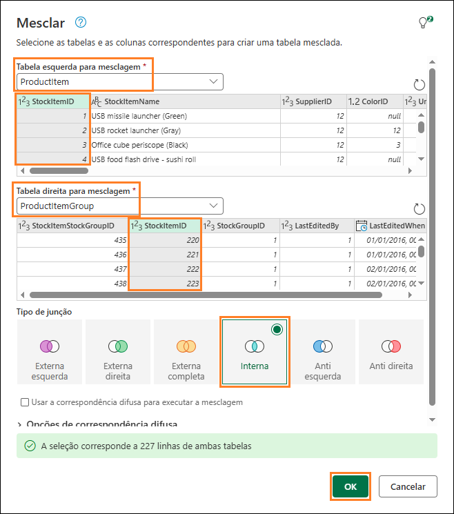

11. Com a consulta Merge selecionada, selecione **Página Inicial - >
    Editor Avançado** na faixa de opções. A caixa de diálogo Editor
    Avançado é aberta.

    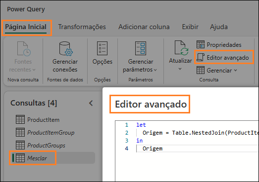

    - **Observação:** se você não conseguir encontrar o Editor Avançado,
poderá acessá-lo em **Início -> Consulta -> Editor Avançado**.

12. **Selecione todo o código** no Editor Avançado e **exclua-o**.

13. **Cole** o código abaixo no Editor Avançado.

    ```
    let
       Source = Table.NestedJoin(ProductItem, {"StockItemID"}, ProductItemGroup, {"StockItemID"}, "ProductItemGroup", JoinKind.LeftOuter),
       #"Expanded ProductItemGroup" = Table.ExpandTableColumn(Source, "ProductItemGroup", {"StockGroupID"}, {"StockGroupID"}),
       #"Merged queries" = Table.NestedJoin(#"Expanded ProductItemGroup", {"StockGroupID"}, ProductGroups, {"StockGroupID"}, "ProductGroups", JoinKind.LeftOuter),
       #"Expanded ProductGroups" = Table.ExpandTableColumn(#"Merged queries", "ProductGroups", {"StockGroupName"}, {"StockGroupName"}),
       #"Choose columns" = Table.SelectColumns(#"Expanded ProductGroups", {"StockItemID", "StockItemName", "SupplierID", "Size", "IsChillerStock", "TaxRate", "UnitPrice", "RecommendedRetailPrice", "TypicalWeightPerUnit", "StockGroupName"})
    in
       #"Choose columns"
    ```

14. Selecione **OK** para fechar o Editor Avançado. Você voltará para o
    Editor do Power Query.

    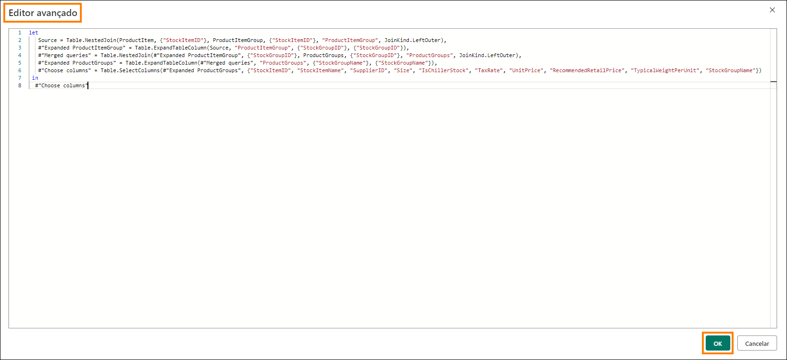

15. No painel Consultas à esquerda, **clique duas vezes na consulta
    Merge** para renomeá-la.

16. **Altere o nome** da consulta Merge para **Product**.

17. Clique com o botão direito do mouse na consulta Product e selecione
    **Habilitar carga** para permitir que a consulta seja carregada.

18. Selecione **Salvar** para salvar e fechar a caixa de diálogo Power
    Query. Você será direcionado à consulta Visual.

    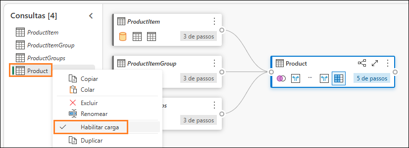

19. No menu de consultas Visual, selecione **Salvar como exibição**. A
    caixa de diálogo Salvar como exibição é aberta. Observe que a
    consulta SQL está disponível. Você pode revê-la, se quiser.

20. Insira **Product** como **Nome da exibição**.

21. Selecione **OK** para salvar a exibição.

    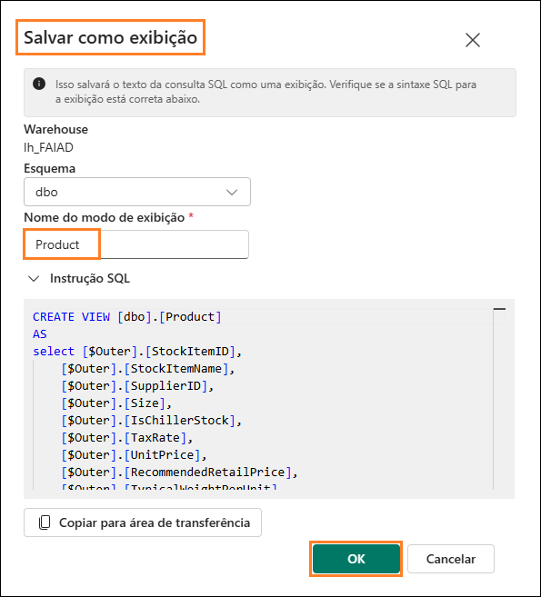

    Você receberá um alerta assim que a exibição for salva.

22. No painel Explorer (à esquerda), expanda **Views.** Temos a exibição
    recém-criada Product.

    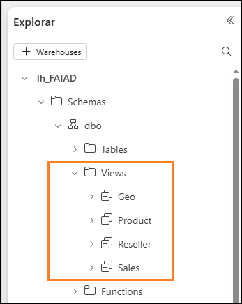

    Transformamos os dados da fonte de dados ADLS Gen2. Neste laboratório,
aprendemos a criar atalhos e exploramos várias opções para usar modos de
exibição de consulta visual para transformar dados.

    No próximo laboratório, aprenderemos a usar o Fluxo de Dados Gen2 e
criar o Atalho para outro Lakehouse.

# Referências

O Fabric Analyst in a Day (FAIAD) apresenta algumas das principais
funções disponíveis no Microsoft Fabric. No menu do serviço, a seção
Ajuda (?) tem links para ótimos recursos.

   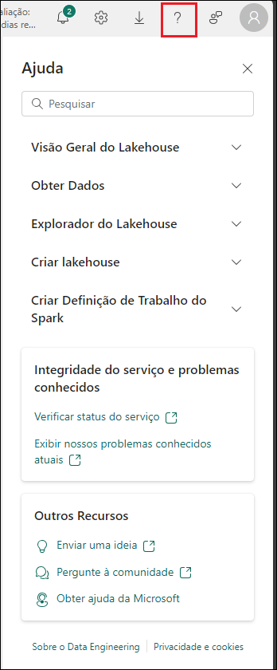

Veja aqui mais alguns recursos que ajudarão você com as próximas etapas
do Microsoft Fabric.

- Veja a postagem do blog para ler o [anúncio completo de GA do
    Microsoft Fabric](https://aka.ms/Fabric-Hero-Blog-Ignite23)

- Explore o Fabric por meio do [Tour
    Guiado](https://aka.ms/Fabric-GuidedTour)

- Inscreva-se para a [avaliação gratuita do Microsoft
    Fabric](https://aka.ms/try-fabric)

- Visite o [site do Microsoft Fabric](https://aka.ms/microsoft-fabric)

- Aprenda novas habilidades explorando os [módulos de Aprendizagem do
    Fabric](https://aka.ms/learn-fabric)

- Explore a [documentação técnica do
    Fabric](https://aka.ms/fabric-docs)

- Leia o [livro eletrônico gratuito sobre como começar a usar o
    Fabric](https://aka.ms/fabric-get-started-ebook)

- Participe da [comunidade do Fabric](https://aka.ms/fabric-community)
    para postar suas perguntas, compartilhar seus comentários e aprender
    com outras pessoas

Leia os blogs de comunicados de experiências do Fabric em mais detalhes:

- [Experiência do Data Factory no blog do
    Fabric](https://aka.ms/Fabric-Data-Factory-Blog) 

- [Experiência do Synapse Data Engineering no blog do
    Fabric](https://aka.ms/Fabric-DE-Blog) 

- [Experiência do Synapse Data Science no blog do
    Fabric](https://aka.ms/Fabric-DS-Blog) 

- [Experiência do Synapse Data Warehousing no blog do
    Fabric](https://aka.ms/Fabric-DW-Blog) 

- [Experiência do Synapse Real-Time Analytics no blog do
    Fabric](https://aka.ms/Fabric-RTA-Blog)

- [Blog de comunicado do Power BI](https://aka.ms/Fabric-PBI-Blog)

- [Experiência do Data Activator no blog do
    Fabric](https://aka.ms/Fabric-DA-Blog) 

- [Administração e governança no blog do
    Fabric](https://aka.ms/Fabric-Admin-Gov-Blog)

- [OneLake no blog do Fabric](https://aka.ms/Fabric-OneLake-Blog)

- [Blog de integração do Dataverse e Microsoft
    Fabric](https://aka.ms/Dataverse-Fabric-Blog)

© 2025 Microsoft Corporation. Todos os direitos reservados.

Ao usar esta demonstração/este laboratório, você concorda com os
seguintes termos:

A tecnologia/funcionalidade descrita nesta demonstração/neste
laboratório é fornecida pela Microsoft Corporation para obter seus
comentários e oferecer uma experiência de aprendizado. Você pode usar a
demonstração/o laboratório somente para avaliar tais funcionalidades e
recursos de tecnologia e fornecer comentários à Microsoft. Você não pode
usá-los para nenhuma outra finalidade. Você não pode modificar, copiar,
distribuir, transmitir, exibir, executar, reproduzir, publicar,
licenciar, criar obras derivadas, transferir nem vender esta
demonstração/este laboratório ou qualquer parte deles.

A CÓPIA OU A REPRODUÇÃO DA DEMONSTRAÇÃO/DO LABORATÓRIO (OU DE QUALQUER
PARTE DELES) EM QUALQUER OUTRO SERVIDOR OU LOCAL PARA REPRODUÇÃO OU
REDISTRIBUIÇÃO ADICIONAL É EXPRESSAMENTE PROIBIDA.

ESTA DEMONSTRAÇÃO/ESTE LABORATÓRIO FORNECE DETERMINADOS RECURSOS E
FUNCIONALIDADES DE PRODUTO/TECNOLOGIA DE SOFTWARE, INCLUINDO NOVOS
RECURSOS E CONCEITOS POTENCIAIS, EM UM AMBIENTE SIMULADO SEM
CONFIGURAÇÃO NEM INSTALAÇÃO COMPLEXA PARA A FINALIDADE DESCRITA ACIMA. A
TECNOLOGIA/OS CONCEITOS REPRESENTADOS NESTA DEMONSTRAÇÃO/NESTE
LABORATÓRIO PODEM NÃO REPRESENTAR A FUNCIONALIDADE COMPLETA DOS RECURSOS
E PODEM NÃO FUNCIONAR DA MESMA MANEIRA QUE UMA VERSÃO FINAL. ALÉM DISSO,
PODEMOS NÃO LANÇAR UMA VERSÃO FINAL DE TAIS RECURSOS OU CONCEITOS. SUA
EXPERIÊNCIA COM O USO DE TAIS RECURSOS E FUNCIONALIDADES EM UM AMBIENTE
FÍSICO TAMBÉM PODE SER DIFERENTE.

**COMENTÁRIOS**. Caso você forneça comentários sobre os recursos de
tecnologia, as funcionalidades e/ou os conceitos descritos nesta
demonstração/neste laboratório à Microsoft, você concederá à Microsoft,
sem encargos, o direito de usar, compartilhar e comercializar seus
comentários de qualquer forma e para qualquer finalidade. Você também
concede a terceiros, sem encargos, quaisquer direitos de patente
necessários para que seus produtos, suas tecnologias e seus serviços
usem ou interajam com partes específicas de um software ou um serviço da
Microsoft que inclua os comentários. Você não fornecerá comentários que
estejam sujeitos a uma licença que exija que a Microsoft licencie seu
software ou sua documentação para terceiros em virtude da inclusão de
seus comentários neles. Esses direitos continuarão em vigor após o
término do contrato.

POR MEIO DESTE, A MICROSOFT CORPORATION SE ISENTA DE TODAS AS GARANTIAS
E CONDIÇÕES REFERENTES À DEMONSTRAÇÃO/AO LABORATÓRIO, INCLUINDO TODAS AS
GARANTIAS E CONDIÇÕES DE COMERCIALIZAÇÃO, SEJAM ELAS EXPRESSAS,
IMPLÍCITAS OU ESTATUTÁRIAS, E DE ADEQUAÇÃO A UMA FINALIDADE ESPECÍFICA,
TÍTULO E NÃO VIOLAÇÃO. A MICROSOFT NÃO DECLARA NEM GARANTE A PRECISÃO
DOS RESULTADOS DERIVADOS DO USO DA DEMONSTRAÇÃO/DO LABORATÓRIO NEM
A ADEQUAÇÃO DAS INFORMAÇÕES CONTIDAS NA DEMONSTRAÇÃO/NO LABORATÓRIO A
QUALQUER FINALIDADE.

**AVISO DE ISENÇÃO DE RESPONSABILIDADE**

Esta demonstração/este laboratório contém apenas uma parte dos novos
recursos e aprimoramentos do Microsoft Power BI. Alguns dos recursos
podem ser alterados em versões futuras do produto. Nesta
demonstração/neste laboratório, você aprenderá sobre alguns dos novos
recursos, mas não todos.

