# Microsoft Fabric Fabric Analyst in a Day - Laboratorio 4

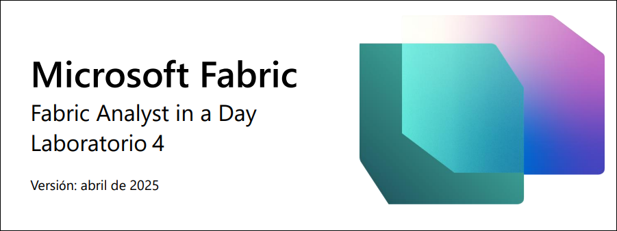

# Contenido
- Presentación
- Flujo de datos Gen2
    - Tarea 1: Copiar consultas de SharePoint al flujo de datos
    - Tarea 2: Crear una conexión a SharePoint
    - Tarea 3: Configurar el destino de datos para la consulta People
    - Tarea 4: Publicar y cambiar el nombre del flujo de datos de SharePoint
    - Tarea 5: Copiar consultas de Snowflake al flujo de datos
    - Tarea 6: Crear una conexión a Snowflake
    - Tarea 7: Configurar el destino de datos para las consultas de Supplier y PO
    - Tarea 8: Cambiar el nombre y publicar el flujo de datos de Snowflake
- Acceso directo a ADLS Gen2
    - Tarea 9: Cómo crear un acceso directo a Dataverse
    - Tarea 10: Crear un acceso directo a un almacén de lago de datos
- Referencias

# Presentación

En nuestro escenario, los datos del proveedor están en Snowflake, los
datos del cliente están en Dataverse y los datos de los empleados están
en SharePoint. Todos estos orígenes de datos se actualizan en diferentes
momentos. Para minimizar la cantidad de actualizaciones de datos para
flujos de datos, crearemos flujos de datos individuales para los
orígenes de datos de Snowflake y SharePoint.

**Nota:** Se admiten varios orígenes de datos en un único flujo de
datos.

El equipo de TI ya ha establecido un vínculo a Dataverse y aplicado las
transformaciones de datos necesarias, reflejándolas en el archivo de
Power BI Desktop. Han ingerido estos datos al almacén de lago de datos
en el área de trabajo de administración y nos han dado acceso a las
tablas. Vamos a crear un acceso directo a las tablas que ha creado el
equipo de TI del almacén de lago de datos.

Al final de este laboratorio, habrá aprendido:

- Cómo conectarse a SharePoint mediante el flujo de datos Gen2 e ingerir
  datos en el almacén de lago de datos

- Cómo conectarse a Snowflake mediante el flujo de datos Gen2 e ingerir
  datos en el almacén de lago de datos

- Cómo ingerir datos desde un almacén de lagos compartido

# Flujo de datos Gen2

## Tarea 1: Copiar consultas de SharePoint al flujo de datos

1. Volvamos al área de trabajo de Fabric, **FAIAD_<inject key="Deployment ID" enableCopy="false"/> (1)**,
    que creó en el Laboratorio 2, Tarea 8.

2. Seleccione la opción **+ Nuevo elemento (2)** en la esquina superior
    derecha.

3. En la sección **Obtener datos (3),** seleccione **Flujo de datos
    Gen2 (4)**.

    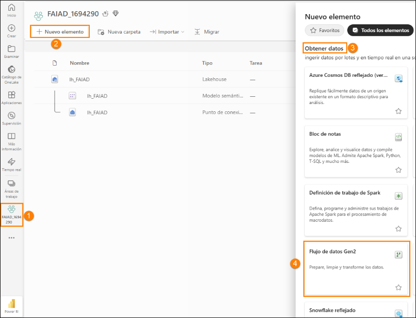

    Se le dirigirá de vuelta a la **página de del flujo de datos**. La
    interfaz Flujo de datos Gen2 es como Power Query en Power BI Desktop.
    Podemos copiar consultas desde el flujo de datos Gen2 de
    Power BI Desktop. Vamos a intentarlo.

4. Si todavía no lo ha abierto, abra **FAIAD.pbix** que se encuentra en
    la carpeta **Reports** del escritorio de su entorno de laboratorio.

5. En la cinta de opciones, seleccione **Inicio -> Transformar
    datos**. Se abre la ventana de Power Query. Como habrá notado en la
    práctica de los laboratorios anteriores, las consultas en el panel
    izquierdo están organizadas por orígenes de datos.

6. En el panel izquierdo, en la carpeta SharepointData, **seleccione
    la** consulta **People**.

7. **Haga clic con el botón derecho** y seleccione **Copiar**.

    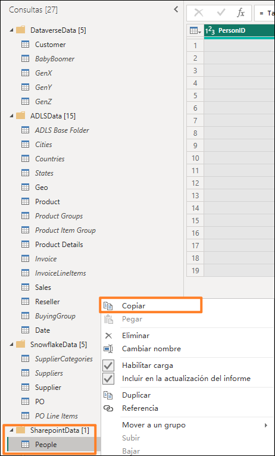

8. Vuelva a la **pantalla del flujo de datos** en el explorador.

9. En el **panel del flujo de datos**, introduzca **Ctrl+V**
    (actualmente, hacer clic con el botón derecho en Pegar no es
    compatible). Si está utilizando un dispositivo MAC, utilice Cmd+V
    para pegar.

    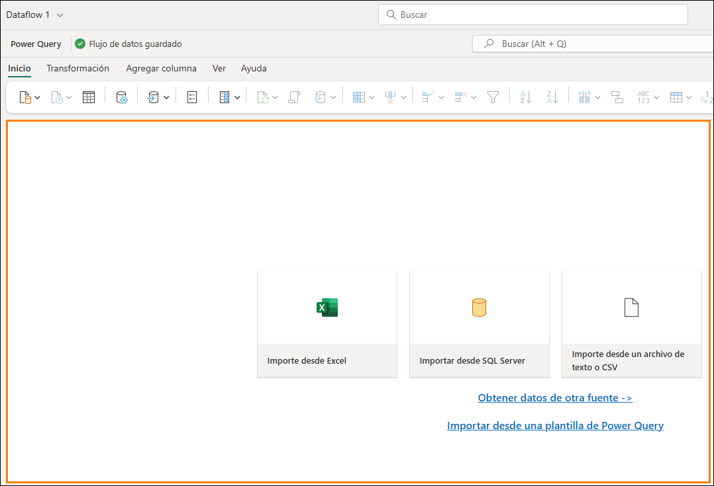

    **Nota:** Si está trabajando en el entorno de laboratorio, seleccione
    los puntos suspensivos en la parte superior derecha de la pantalla.
    Utilice el control deslizante para **habilitar** **Portapapeles nativo
    de VM**. Seleccione Aceptar en el cuadro de diálogo. Una vez que haya
    terminado de pegar las consultas, puede desactivar esta opción.

    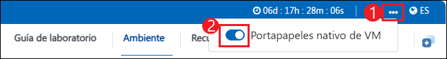

    Observe la consulta se ha pegado y está disponible en el panel
    izquierdo. Como no tenemos una conexión creada para SharePoint, verá un
    mensaje de advertencia que le solicitará que configure la conexión.

## Tarea 2: Crear una conexión a SharePoint

1. Seleccione **Configurar conexión**.

    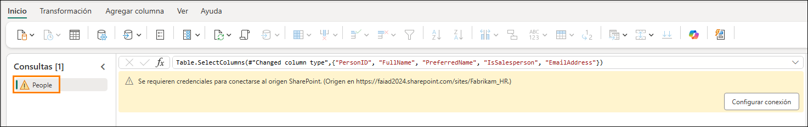

2. Se abre el cuadro de diálogo del origen de datos. En el menú
    desplegable **Conexión**, asegúrese de que **Crear nueva conexión**
    esté seleccionado.

3. **Tipo de autenticación** debería ser **Cuenta de organización**.

4. Seleccione **Conectar**.

    > **Nota:** Iniciará sesión con sus credenciales. Serán diferentes a la captura de pantalla siguiente.

    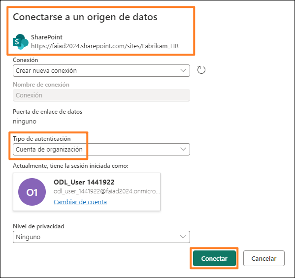

## Tarea 3: Configurar el destino de datos para la consulta People

Se establece la conexión y puede ver los datos en el panel de versión
preliminar. Siéntase libre de navegar por los pasos aplicados de las
consultas. Ahora necesitamos incorporar los datos de People en el
almacén de lago de datos.

1. Seleccione la consulta **People (1)**.

2. En la cinta de opciones, seleccione **Inicio -> Consulta (2) ->
    Agregar destino de datos (3) -> Almacén de lago de datos (4)**.

    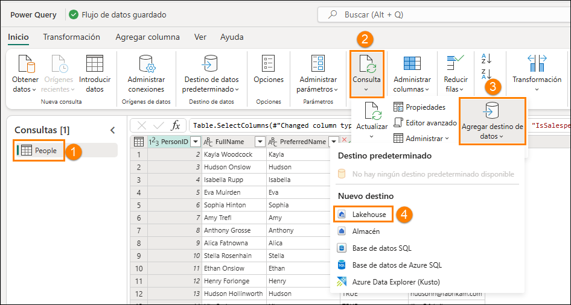

3. Se abre el cuadro de diálogo Conectarse al destino de datos.
    Necesitamos crear una nueva conexión con el almacén de lago de
    datos. Con **Crear nueva conexión** seleccionado en el menú
    desplegable Conexión y **Tipo de autenticación** configurado en
    **Cuenta de organización**, seleccione **Siguiente**.

    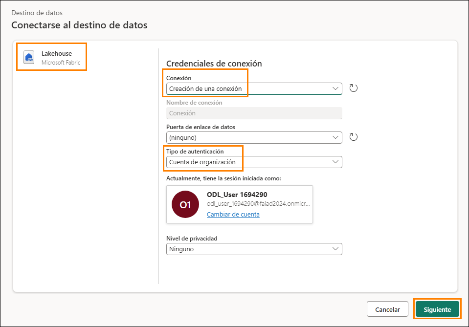

4. Se abre el cuadro de diálogo de Elegir el objetivo de destino.
    Asegúrese de que el **botón de opción** Nueva tabla esté
    seleccionado, ya que estamos creando una nueva tabla.

5. Queremos crear la tabla en el lakehouse que creamos anteriormente. En el panel izquierdo, navegue hasta **Lakehouse -> FAIAD_<inject key="Deployment ID" enableCopy="false"/>**.

6. Seleccione **lh_FAIAD**.

7. Deje el nombre de la tabla como **People**

8. Seleccione **Siguiente**.

    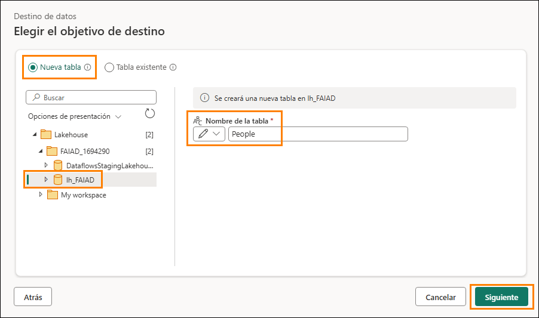

9. Se abre el cuadro de diálogo de Elegir la configuración de destino.
    Asegúrese de que la opción "**Usar configuración automática**" esté
    **habilitada**.

    **Nota:** Puede deshabilitar la configuración automática y observe que
    tiene opciones para establecer las opciones Método de actualización y
    Esquema. Cuando haya finalizado la exploración, asegúrese de que la
    opción "**Usar configuración automática**" esté **habilitada**.

10. Seleccione **Guardar configuración**.

    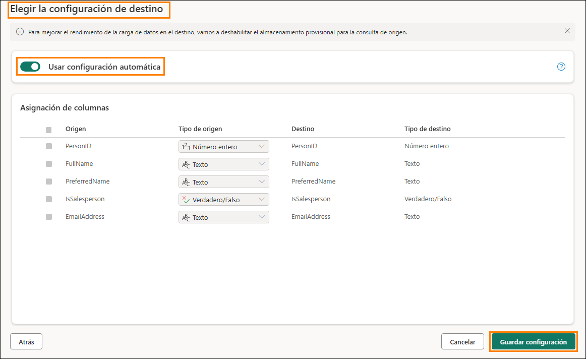

## Tarea 4: Publicar y cambiar el nombre del flujo de datos de SharePoint

1. Volverá a la **ventana de Power Query**. Observe que en la **esquina
    inferior derecha**, el destino de los datos está configurado en el
    **lakehouse**.

2. En la esquina inferior derecha, seleccione **Publicar**.

    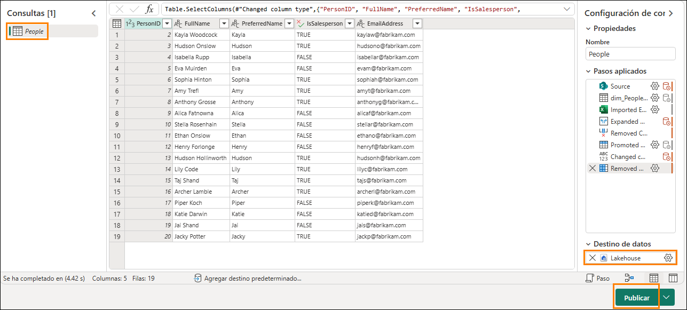

    **Nota:** Se le dirigirá de vuelta al área de trabajo
    **FAIAD_<inject key="Deployment ID" enableCopy="false"/>**. Es posible que el flujo de datos tarde unos
    minutos en publicarse.

3. **Estamos trabajando con Dataflow 1**. Vamos a cambiarle el nombre
    antes de continuar. Haga clic en los **puntos suspensivos (...)**
    junto a Dataflow 1. Seleccione **Propiedades** (Mientras se ejecuta
    el flujo de datos, no puede acceder a las propiedades).

    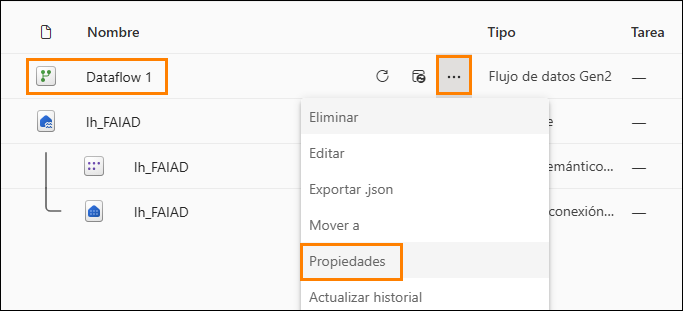

4. Se abre el cuadro de diálogo de propiedades del flujo de datos.
    Cambie el **nombre** a **df_People_SharePoint**.

5. En el cuadro de texto **Descripción**, agregue **Flujo de datos para
    ingerir datos de People desde SharePoint a Almacén de lago de
    datos**.

6. Seleccione **Guardar**.

    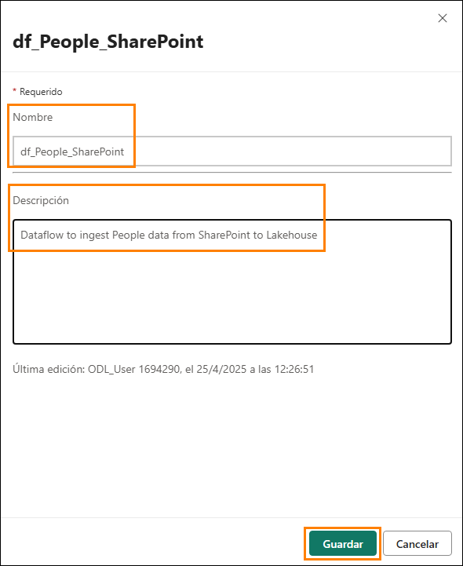

    Se le dirigirá de vuelta al **área de trabajo FAIAD_<inject key="Deployment ID" enableCopy="false"/>**.

7. Seleccione **lh_FAIAD** para ir al almacén de lago de datos.

8. Asegúrese de estar en la vista del almacén de lago de datos (no en
    el punto de conexión de análisis SQL).

9. Observe que la tabla **People** esté ahora disponible en el almacén
    de lago de datos.

    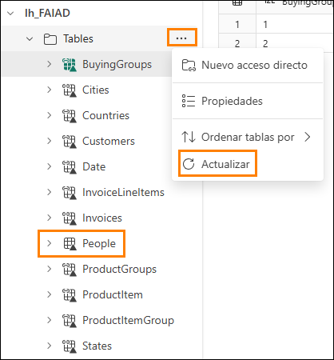

    **Nota:** Si no ve las tablas recién creadas, seleccione los puntos
    suspensivos junto a Tables y seleccionar Actualizar para actualizar las
    tablas.

## Tarea 5: Copiar consultas de Snowflake al flujo de datos

1. Volvamos al área de trabajo de Fabric, **FAIAD_<inject key="Deployment ID" enableCopy="false"/> (1)**.

2. Seleccione la opción **+ Nuevo elemento (2)** en la esquina superior
    derecha.

3. En Artículos recomendados, seleccione **Dataflow Gen2 (3)**.

    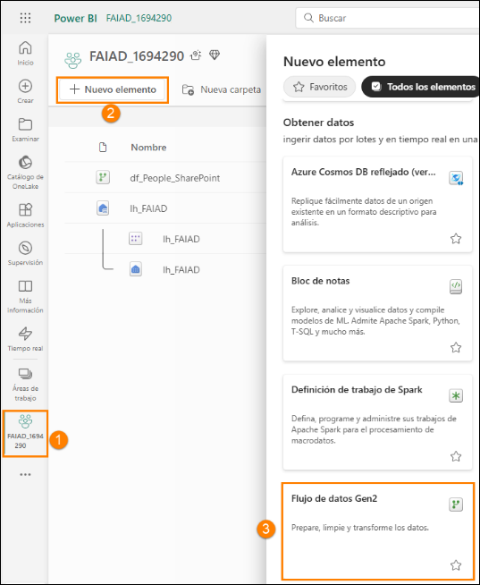

    Se le dirigirá de vuelta a la **página de del flujo de datos**. Ahora
    que estamos familiarizados con el flujo de datos, sigamos adelante y
    copiemos las consultas de Power BI Desktop en el flujo de datos.

4. Si todavía no lo ha abierto, abra **FAIAD.pbix** que se encuentra en
    la carpeta **Reports** del escritorio de su entorno de laboratorio.

5. En la cinta de opciones, seleccione **Inicio -> Transformar
    datos**. Se abre la ventana de Power Query. Como habrá notado en la
    práctica de laboratorio anterior, las consultas en el panel
    izquierdo están organizadas por orígenes de datos.

6. Desde el panel izquierdo, en la carpeta **SnowflakeData**
    **Ctrl+Seleccionar** o Mayús+Seleccionar las siguientes consultas:

    a. SupplierCategories

    b. Suppliers

    c. Supplier

    d. PO

    e. PO Line Items

7. **Haga clic con el botón derecho** y seleccione **Copiar**.

    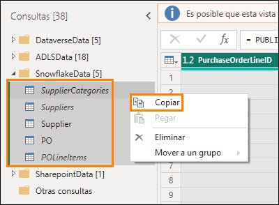

8. Vuelva al **explorador**.

9. En el **panel del flujo de datos**, seleccione el **panel central**,
    introduzca **Ctrl+V** (actualmente, hacer clic con el botón derecho
    en Pegar no es compatible). Si está utilizando un dispositivo MAC,
    utilice Cmd+V para pegar.

    **Nota:** Si está trabajando en el entorno de laboratorio, seleccione
    los **puntos suspensivos (...)** en la parte superior derecha de la
    pantalla. Utilice el control deslizante para **habilitar**
    **Portapapeles nativo de VM**. Seleccione Aceptar en el cuadro de
    diálogo. Una vez que haya terminado de pegar las consultas, puede
    desactivar esta opción.

    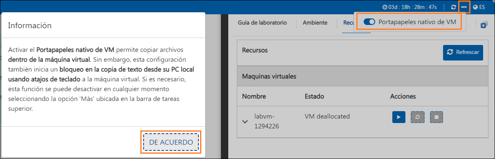

## Tarea 6: Crear una conexión a Snowflake

Observe que las cinco consultas están pegadas y ahora tiene el panel
Consultas a la izquierda. Como no tenemos una conexión creada para
Snowflake, verá un mensaje de advertencia que le solicitará que
configure la conexión.

1. Seleccione **Configurar conexión**.

    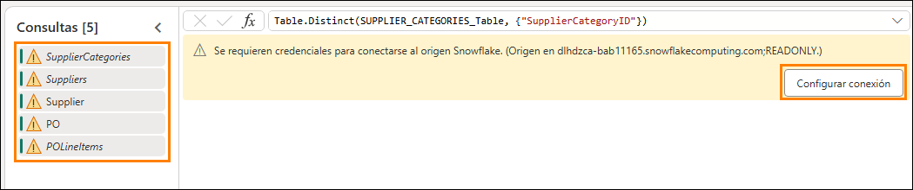

2. Se abre el cuadro de diálogo del origen de datos. En el menú
    desplegable **Conexión**, asegúrese de que **Crear nueva conexión**
    esté seleccionado.

3. **El tipo de autenticación** debe ser **Snowflake**.

4. Introduzca el **nombre de usuario de Snowflake** y la **contraseña
    de Snowflake** que se proporcionan a continuación. Use estas
    credenciales para conectar todas las tablas de Snowflake con
    Snowflake y luego seleccione **Conectar**.

    - **Nombre de usuario de Snowflake:** <inject key="SnowFlake Username"></inject>

    - **Contraseña de Snowflake:** <inject key="SnowFlake Password"></inject>

    **Nota:** Si tiene algún problema para conectarse a Snowflake con las
    credenciales de los detalles del entorno, utilice las credenciales que
    se proporcionan a continuación.

    - **Nombre de usuario de Snowflake:** SNOWFLAKE_BACKUP

    - **Contraseña de Snowflake:** 8UpfRpExVDXv2AC1

5. Seleccione **Conectar**.

    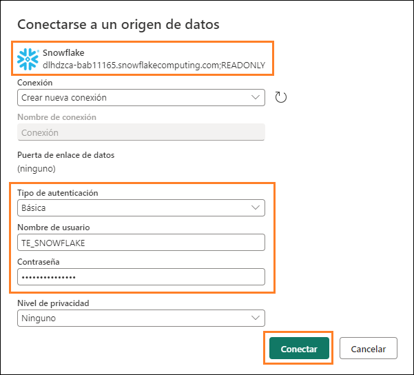

Se establece la conexión y puede ver los datos en el panel de versión
preliminar. Siéntase libre de navegar por los pasos aplicados de las
consultas. Básicamente, la consulta Suppliers tiene los detalles de los
proveedores y SupplierCategories, como el nombre implica, esta tabla
tiene todas las categorías de proveedores. Estas dos tablas se unen para
crear la dimensión Supplier, con las columnas que necesitamos. De manera
similar, tenemos PO Line Items combinada con pedidos de compra para
crear el dato de PO. Ahora necesitamos incorporar los datos de Supplier
y de PO en el almacén de lago de datos.

## Tarea 7: Configurar el destino de datos para las consultas de Supplier y PO

1. Seleccione la consulta de **Supplier (1)**.

2. En la cinta de opciones, seleccione **Inicio (2) -> Agregar destino de datos (3) -> Lakehouse (4)**.

    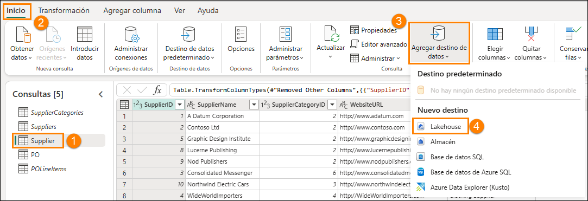

3. Se abre el cuadro de diálogo Conectarse al destino de datos. Desde
    el **menú desplegable Conexión**, seleccione **Lakehouse
    (ninguno)**.

4. Seleccione **Siguiente**.

    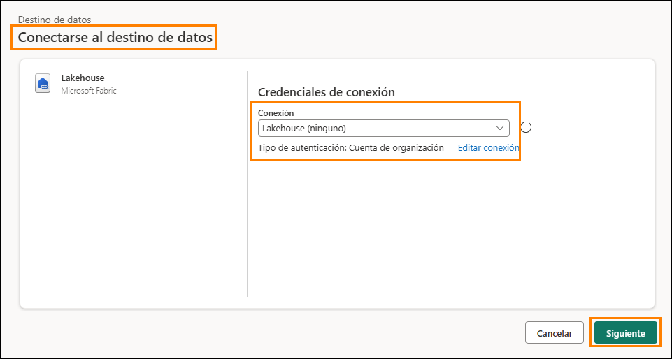

5. Se abre el cuadro de diálogo de Elegir el objetivo de destino.
    Asegúrese de que el botón de opción **Nueva tabla** esté
    seleccionado, ya que estamos creando una nueva tabla.

6. Queremos crear la tabla en el lakehouse que creamos anteriormente. En el panel izquierdo, navegue hasta **Lakehouse -> FAIAD_<inject key="Deployment ID" enableCopy="false"/>**.

7. Seleccione **lh_FAIAD**.

8. Deje el nombre de la tabla como **Supplier**

9. Seleccione **Siguiente**.

    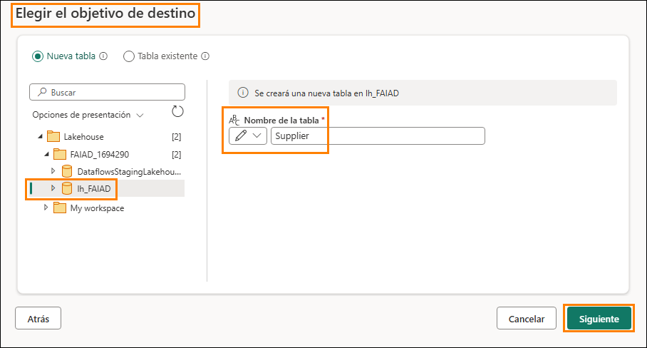

10. Se abre el cuadro de diálogo de Elegir la configuración de destino.
    Usaremos la configuración automática, ya que esto realizará una
    actualización completa de los datos. Además, cambiará el nombre de
    las columnas según sea necesario. Seleccione **Guardar
    configuración**.

    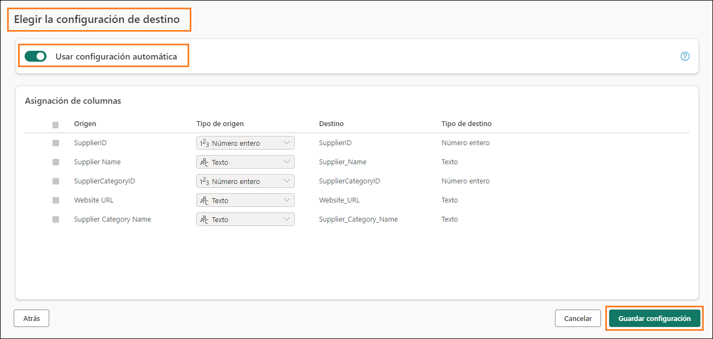

11. Volverá a la **ventana de Power Query**. Observe que en la **esquina
    inferior derecha, el destino de los datos** está configurado en el
    **lakehouse**. De manera similar, **configure el destino de datos
    para la consulta de PO**. Una vez hecho esto, su consulta de **PO**
    debe tener **Destino de datos** establecido en **Almacén de lago de
    datos** como se muestra en la siguiente captura de pantalla.

    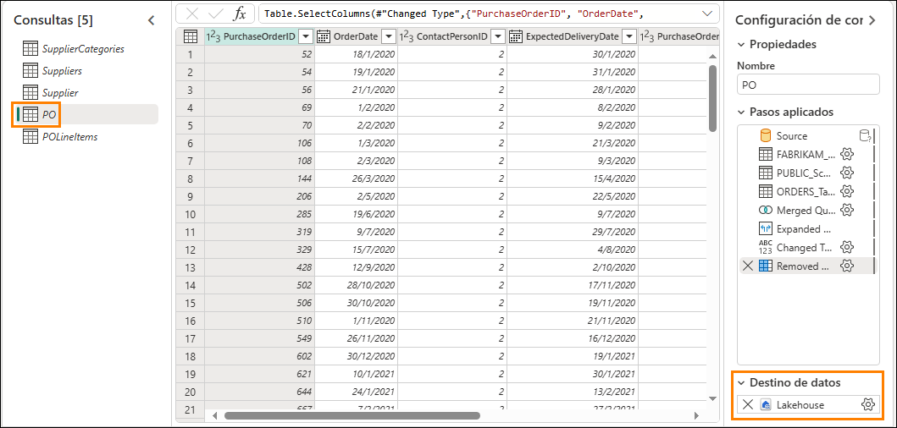

## Tarea 8: Cambiar el nombre y publicar el flujo de datos de Snowflake

1. En la parte superior de la pantalla, seleccione la **flecha junto a
    Dataflow 1** para cambiar el nombre.

2. En el cuadro de diálogo, cambie el nombre a
    **df_Supplier_Snowflake**.

3. Haga clic en **Introducir** para guardar el cambio de nombre.

    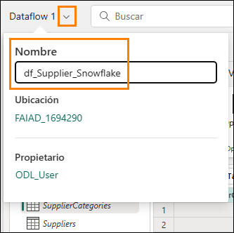

4. En la esquina inferior derecha, seleccione **Publicar**.

    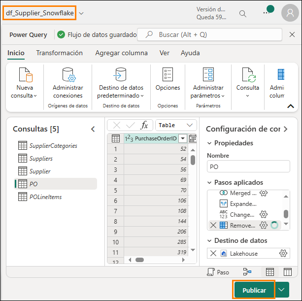

    Se le dirigirá de vuelta al **área de trabajo FAIAD_<inject key="Deployment ID" enableCopy="false"/>**. Es
    posible que el flujo de datos tarde unos minutos en publicarse.

5. Seleccione **lh_FAIAD** para ir al almacén de lago de datos.

6. Asegúrese de estar en la vista del almacén de lago de datos (no en
    el punto de conexión de análisis SQL).

7. Observe que la tabla **PO** y **Supplier** ahora están disponibles
    en el almacén de lago de datos.

    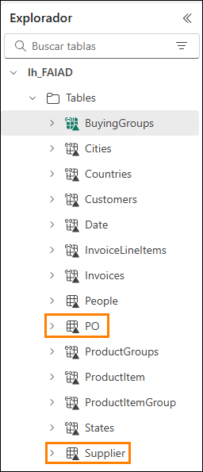

    **Nota:** Si no ve las tablas recién creadas, seleccione los puntos
    suspensivos junto a Tables y seleccionar Actualizar para actualizar las
    tablas.

Ahora creemos un acceso directo para traer datos de Dataverse.

# Acceso directo a ADLS Gen2

## Tarea 9: Cómo crear un acceso directo a Dataverse

Debe estar en el almacén de lago de datos **lh_FAIAD**. Asegúrese de
estar en la vista del almacén de lago de datos (no en el punto de
conexión de análisis SQL).

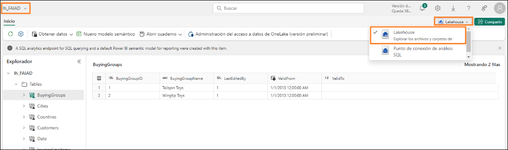

1. En el panel del **Explorador** de la izquierda, seleccione los
    **puntos suspensivos** al lado de **Tables**.

2. Seleccione **Nuevo acceso directo**.

    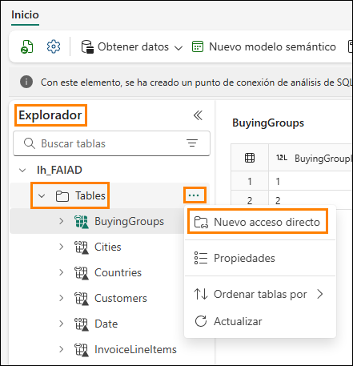

3. Se abre el cuadro de diálogo Nuevo acceso directo. En **Orígenes
    externos**, seleccione **Dataverse**.

    **Nota:** En la práctica de laboratorio anterior, seguimos pasos
    similares para crear un acceso directo a Azure Data Lake Storage Gen2.

    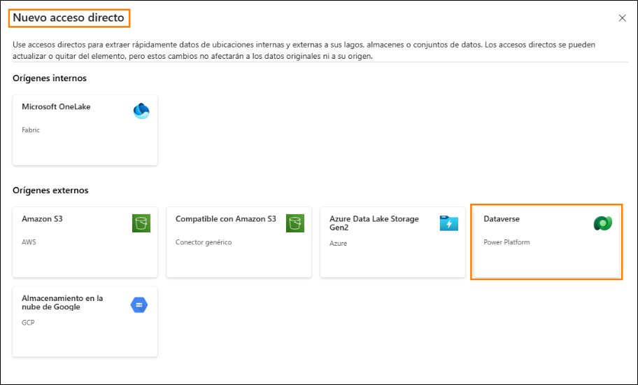

4. **Seleccione Crear nueva conexión (1)** y se abre el cuadro de
    diálogo Configuración de conexión. Introduzca
    **org6c18814a.crm.dynamics.com (2)** como **dominio del entorno**.

5. Deje **Tipo de autenticación** como **Cuenta de organización (3)**.

6. Seleccione **Iniciar sesión** si todavía no ha iniciado sesión.

    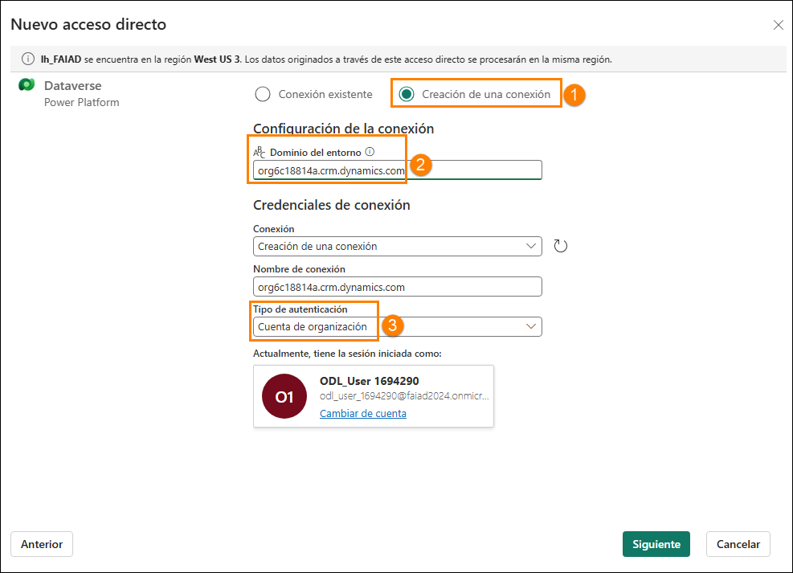

7. En el cuadro de diálogo de inicio de sesión, seleccione la **cuenta
    de usuario** que ha estado usando para estos laboratorios. **Nota:**
    Su cuenta será diferente de la captura de pantalla siguiente.

    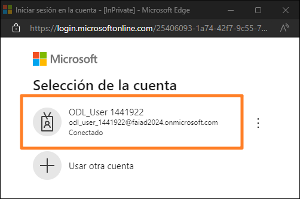

8. Seleccione **Siguiente** en el cuadro de diálogo Configuración de
    conexión.

    Se le dirigirá a un cuadro de diálogo de donde puede elegir el
    cubo/directorio diferente de Dataverse. Observe que hay una gran
    cantidad de cubos disponibles. Podríamos elegir los cubos que
    necesitamos y seguir el proceso del laboratorio 3 (usar la consulta
    visual para transformar datos y crear vistas). También podríamos usar el
    flujo de datos Gen2 como lo usamos anteriormente en este laboratorio
    para conectar SharePoint. Sin embargo, no tenemos acceso a estos
    **cubos/directorios**.

    En nuestro escenario, el equipo de TI ya ha establecido un vínculo a
    Dataverse y aplicado las transformaciones de datos necesarias,
    reflejándolas en el archivo de Power BI Desktop. Han ingerido estos
    datos al almacén de lago de datos en el área de trabajo de
    administración y nos han dado acceso a las tablas. Puesto que nuestro
    equipo informático ha hecho todo el trabajo duro, podemos crear un
    acceso directo a este almacén de lago de datos en el área de trabajo de
    administrador.

9. Seleccione **Cancelar** en el cuadro de diálogo Nuevo acceso directo
    para volver al almacén de lago de datos.

    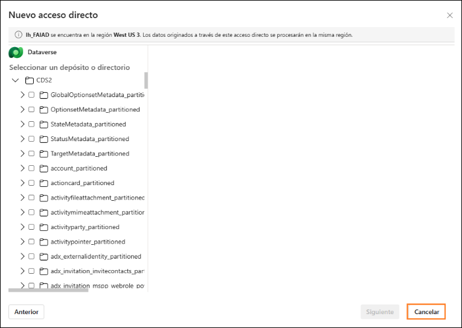

## Tarea 10: Crear un acceso directo a un almacén de lago de datos

1. En el panel del **explorador** de la izquierda, seleccione los
    **puntos suspensivos** al lado de **Tables**.

2. Seleccione **Nuevo acceso directo**.

    

3. Se abre el cuadro de diálogo Nuevo acceso directo. Seleccione la
    opción **Microsoft OneLake** en orígenes internos.

    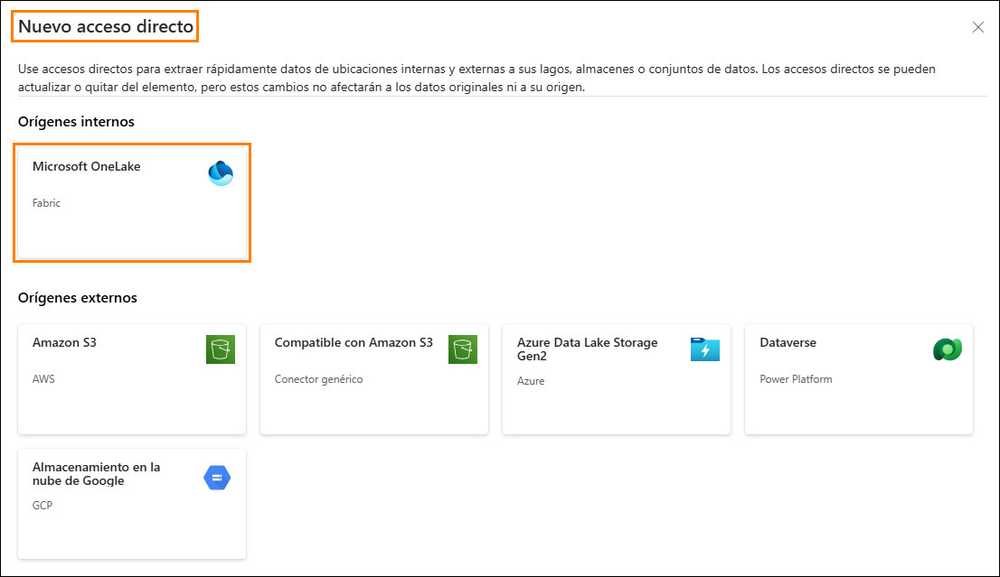

4. Seleccione **lh_dataverse**.

5. Seleccione **Siguiente**.

    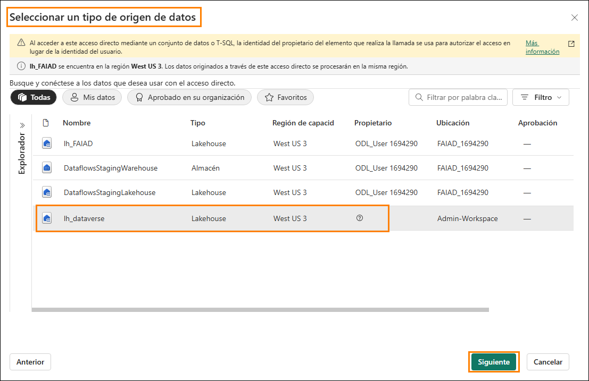

6. En el panel izquierdo, expanda **lh_dataverse -> Tables**. Observe
    que el administrador de TI ha proporcionado acceso a la tabla
    Cliente.

7. Seleccione **Cliente**.

8. Seleccione **Siguiente**.

    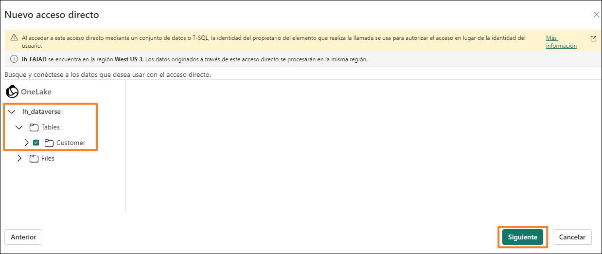

9. Seleccione **Crear** en el siguiente cuadro de diálogo. Se le
    dirigirá de vuelta al almacén de lago de datos lh_FAIAD.

    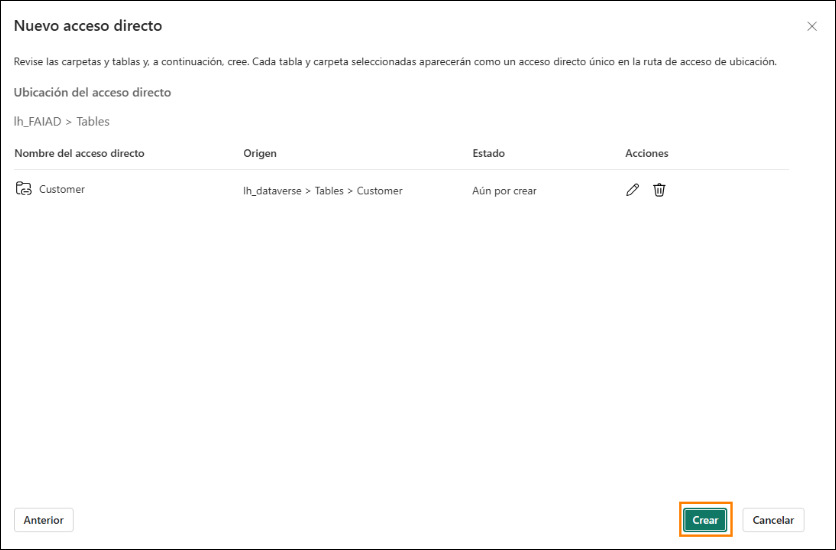

10. En el panel **Explorador** de la izquierda, observe que se ha creado
    la nueva tabla **Cliente**.

11. Seleccione la tabla **Cliente** para ver los datos en el panel de
    versión preliminar.

    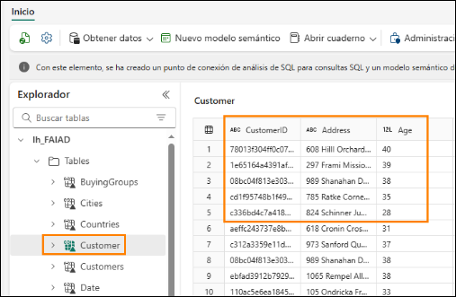

Hemos creado correctamente un acceso directo a otro almacén de lago de
datos.

Ahora hemos ingerido todos los datos en el almacén de lago de datos. En
la próxima práctica de laboratorio, programaremos la actualización del
flujo de datos.

En la próxima práctica de laboratorio, configuraremos actualizaciones de
programaciones.

# Referencias

Fabric Analyst in a Day (FAIAD) le presenta algunas funciones clave
disponibles en Microsoft Fabric. En el menú del servicio, la sección
Ayuda (?) tiene vínculos a algunos recursos excelentes.

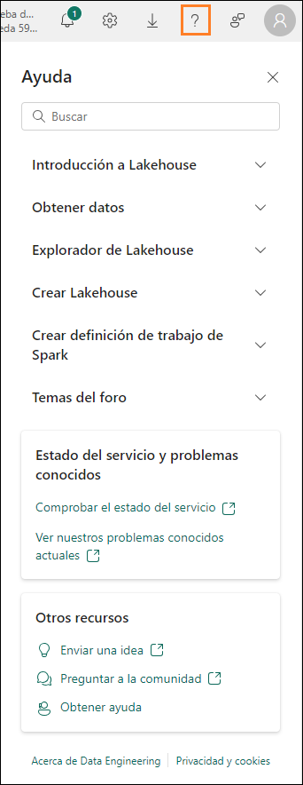

Estos son algunos recursos más que podrán ayudarle a seguir avanzando
con Microsoft Fabric.

- Vea la publicación del blog para leer el [anuncio de disponibilidad
  general de Microsoft Fabric](https://aka.ms/Fabric-Hero-Blog-Ignite23)
  completo.

- Explore Fabric a través de la [Visita
  guiada](https://aka.ms/Fabric-GuidedTour)

- Regístrese en la [prueba gratuita de Microsoft
  Fabric](https://aka.ms/try-fabric)

- Visite el [sitio web de Microsoft
  Fabric](https://aka.ms/microsoft-fabric)

- Adquiera nuevas capacidades mediante la exploración de los [módulos de
  aprendizaje de Fabric](https://aka.ms/learn-fabric)

- Explore la [documentación técnica de
  Fabric](https://aka.ms/fabric-docs)

- Lea el [libro electrónico gratuito sobre cómo empezar a usar
  Fabric](https://aka.ms/fabric-get-started-ebook)

- Únase a la [comunidad de Fabric](https://aka.ms/fabric-community) para
  publicar sus preguntas, compartir sus comentarios y aprender de otros.

Obtenga más información en los blogs de anuncios de la experiencia
Fabric:

- [Experiencia de Data Factory en el blog de
  Fabric](https://aka.ms/Fabric-Data-Factory-Blog) 

- [Experiencia de Synapse Data Engineering en el blog de
  Fabric](https://aka.ms/Fabric-DE-Blog) 

- [Experiencia de Synapse Data Science en el blog de
  Fabric](https://aka.ms/Fabric-DS-Blog) 

- [Experiencia de Synapse Data Warehousing en el blog de
  Fabric](https://aka.ms/Fabric-DW-Blog) 

- [Experiencia de Synapse Real-Time Analytics en el blog de
  Fabric](https://aka.ms/Fabric-RTA-Blog)

- [Blog de anuncios de Power BI](https://aka.ms/Fabric-PBI-Blog)

- [Experiencia de Data Activator en el blog de
  Fabric](https://aka.ms/Fabric-DA-Blog) 

- [Administración y gobernanza en el blog de
  Fabric](https://aka.ms/Fabric-Admin-Gov-Blog)

- [OneLake en el blog de Fabric](https://aka.ms/Fabric-OneLake-Blog)

- [Blog de integración de Dataverse y Microsoft
  Fabric](https://aka.ms/Dataverse-Fabric-Blog)

© 2025 Microsoft Corporation. Alle Rechte vorbehalten.

Durch die Verwendung der vorliegenden Demo/Übung stimmen Sie den
folgenden Bedingungen zu:

Die in dieser Demo/Übung beschriebene Technologie/Funktionalität wird
von der Microsoft Corporation bereitgestellt, um Feedback von Ihnen zu
erhalten und Ihnen Wissen zu vermitteln. Sie dürfen die Demo/Übung nur
verwenden, um derartige Technologiefeatures und Funktionen zu bewerten
und Microsoft Feedback zu geben. Es ist Ihnen nicht erlaubt, sie für
andere Zwecke zu verwenden. Es ist Ihnen nicht gestattet, diese
Demo/Übung oder einen Teil derselben zu ändern, zu kopieren, zu
verbreiten, zu übertragen, anzuzeigen, auszuführen, zu
vervielfältigen, zu veröffentlichen, zu lizenzieren, zu transferieren
oder zu verkaufen oder aus ihr abgeleitete Werke zu erstellen.

DAS KOPIEREN ODER VERVIELFÄLTIGEN DER DEMO/ÜBUNG (ODER EINES TEILS
DERSELBEN) AUF EINEN/EINEM ANDEREN SERVER ODER SPEICHERORT FÜR DIE
WEITERE VERVIELFÄLTIGUNG ODER VERBREITUNG IST AUSDRÜCKLICH UNTERSAGT.

DIESE DEMO/ÜBUNG STELLT BESTIMMTE
SOFTWARE-TECHNOLOGIE-/PRODUKTFEATURES UND FUNKTIONEN, EINSCHLIESSLICH
POTENZIELLER NEUER FEATURES UND KONZEPTE, IN EINER SIMULIERTEN
UMGEBUNG OHNE KOMPLEXE EINRICHTUNG ODER INSTALLATION FÜR DEN OBEN
BESCHRIEBENEN ZWECK BEREIT. DIE TECHNOLOGIE/KONZEPTE IN DIESER
DEMO/ÜBUNG ZEIGEN MÖGLICHERWEISE NICHT DAS VOLLSTÄNDIGE
FUNKTIONSSPEKTRUM UND FUNKTIONIEREN MÖGLICHERWEISE NICHT WIE DIE
ENDGÜLTIGE VERSION. UNTER UMSTÄNDEN VERÖFFENTLICHEN WIR AUCH KEINE
ENDGÜLTIGE VERSION DERARTIGER FEATURES ODER KONZEPTE. IHRE ERFAHRUNG
BEI DER VERWENDUNG DERARTIGER FEATURES UND FUNKTIONEN IN EINER
PHYSISCHEN UMGEBUNG KANN FERNER ABWEICHEND SEIN.

**FEEDBACK**. Wenn Sie Feedback zu den Technologiefeatures, Funktionen
und/oder Konzepten geben, die in dieser Demo/Übung beschrieben werden,
gewähren Sie Microsoft das Recht, Ihr Feedback in jeglicher Weise und
für jeglichen Zweck kostenlos zu verwenden, zu veröffentlichen und
gewerblich zu nutzen. Außerdem treten Sie Dritten kostenlos sämtliche
Patentrechte ab, die erforderlich sind, damit deren Produkte,
Technologien und Dienste bestimmte Teile einer Software oder eines
Dienstes von Microsoft, welche/welcher das Feedback enthält, verwenden
oder eine Verbindung zu dieser/diesem herstellen können. Sie geben
kein Feedback, das einem Lizenzvertrag unterliegt, aufgrund dessen
Microsoft Drittparteien eine Lizenz für seine Software oder
Dokumentation gewähren muss, weil wir Ihr Feedback in diese aufnehmen.
Diese Rechte bestehen nach Ablauf dieser Vereinbarung fort.

DIE MICROSOFT CORPORATION LEHNT HIERMIT JEGLICHE GEWÄHRLEISTUNGEN UND
GARANTIEN IN BEZUG AUF DIE DEMO/ÜBUNG AB, EINSCHLIESSLICH ALLER
AUSDRÜCKLICHEN, KONKLUDENTEN ODER GESETZLICHEN GEWÄHRLEISTUNGEN UND
GARANTIEN DER HANDELSÜBLICHKEIT, DER EIGNUNG FÜR EINEN BESTIMMTEN
ZWECK, DES RECHTSANSPRUCHS UND DER NICHTVERLETZUNG VON RECHTEN
DRITTER. MICROSOFT MACHT KEINERLEI ZUSICHERUNGEN BZW. ERHEBT KEINERLEI
ANSPRÜCHE IM HINBLICK AUF DIE RICHTIGKEIT DER ERGEBNISSE UND DES AUS
DER VERWENDUNG DER DEMO/ÜBUNG RESULTIERENDEN ARBEITSERGEBNISSES BZW.
BEZÜGLICH DER EIGNUNG DER IN DER DEMO/ÜBUNG ENTHALTENEN INFORMATIONEN
FÜR EINEN BESTIMMTEN ZWECK.

**HAFTUNGSAUSSCHLUSS**

Diese Demo/Übung enthält nur einen Teil der neuen Features und
Verbesserungen in Microsoft Power BI. Einige Features können sich
unter Umständen in zukünftigen Versionen des Produkts ändern. In
dieser Demo/Übung erhalten Sie Informationen über einige, aber nicht
über alle neuen Features.