# Microsoft Fabric Fabric Analyst in a Day - Laboratorio 6

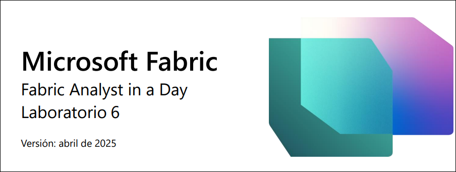

# Contenido
- Presentación
    - Almacén de lago de datos: análisis de datos
    - Tarea 1: Consultar datos con SQL
    - Tarea 2: visualizar el resultado de T-SQL
- Almacén de lago de datos: modelado semántico
    - Tarea 3: Crear un modelo semántico
    - Tarea 4: Crear relaciones
    - Tarea 5: Crear medidas
    - Tarea 6: Sección opcional: crear relaciones
    - Tarea 7: Sección opcional: crear medidas
- Referencias

# Presentación 

Tenemos datos de diferentes orígenes ingeridos en el almacén de lago de
datos. En esta práctica de laboratorio, trabajará con el modelo
semántico. Normalmente, hacemos actividades de modelado como crear
relaciones, agregar medidas, etc. en Power BI Desktop. Aquí aprenderemos
cómo hacer estas actividades de modelado en el servicio.

Al final de este laboratorio, habrá aprendido:

- Uso de la vista SQL en el punto de conexión de análisis SQL

- Cómo crear un modelo semántico

# Almacén de lago de datos: análisis de datos

## Tarea 1: Consultar datos con SQL

1. Volvamos al área de trabajo de Fabric, **FAIAD_<inject key="Deployment ID" enableCopy="false"/>**, que
    creó en el Laboratorio 2, Tarea 8.

2. Si lo desea, **Minimice el flujo de tareas** para ver la lista
    completa de elementos.

3. Verá tres elementos asociados a lh_FAIAD: almacén de lago de datos,
    modelo semántico y punto de conexión SQL. Exploramos el almacén de
    lago de datos y creamos consultas visuales mediante el punto de
    conexión de análisis SQL en un laboratorio anterior. Seleccione la
    opción **Punto de conexión de análisis SQL lh_FAIAD** para continuar
    explorando esta opción. Esto le llevará a la **vista de SQL** del
    explorador.

    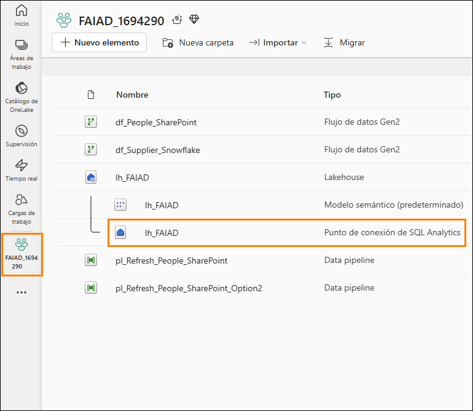

    Si desea explorar los datos antes de crear un modelo de datos, puede
    utilizar SQL para hacerlo. Hay dos opciones disponibles para usar SQL.
    La primera opción es la consulta visual, que utilizamos en el
    laboratorio anterior. La opción 2 es escribir código TSQL. Se trata de
    una opción favorable para los desarrolladores. Exploremos más.

    Supongamos que desea conocer rápidamente las Units vendidas por el
    proveedor mediante SQL.

    En el almacén de lago de datos, punto de conexión de análisis SQL,
    observe que en el panel izquierdo puede ver las tablas. Si expande las
    tablas, puede ver las columnas que componen la tabla. Además, hay
    opciones para crear vistas, funciones y procedimientos almacenados de
    SQL. Si tiene experiencia en SQL, no dude en explorar estas opciones.
    Intentemos escribir una consulta SQL simple.

4. En el **menú superior**, seleccione **Nueva consulta SQL** o en el
    centro de la pantalla haga clic en **Nueva consulta SQL**. Esto le
    llevará a la vista de consultas de SQL.

    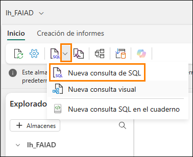

5. Copie la **siguiente consulta de SQL** en la **ventana de
    consultas**. Esta consulta devolverá las unidades por nombre del
    proveedor. Para conseguirlo, se une la tabla Sales con las tablas
    Product y Supplier.

   ```
   SELECT su.SupplierName, SUM(Quantity) as Units
   FROM dbo.Sales s
   JOIN dbo.Product p on p.StockItemID = s.StockItemID
   JOIN dbo.Supplier su on su.SupplierID = p.SupplierID
   GROUP BY su.SupplierName
   ```

6. Haga clic en **Run** en el menú del editor de SQL para ver los
    resultados.

7. Observe que hay una opción para guardar esta consulta como Vista si
    selecciona **Guardar como copia**.

8. En el panel del **explorador** **izquierdo**, en la sección
    **Queries,** observe que esta consulta se guarda en **Mis
    consultas** como **SQL query 1**. Esto proporciona una opción para
    cambiar el nombre de la consulta y guardarla para uso futuro.
    También hay una opción para ver las consultas que se comparten con
    usted mediante la carpeta **Consultas compartidas**.

    > **Nota:** las consultas visuales que había creado en laboratorios anteriores también están disponibles en la carpeta Mis consultas.

    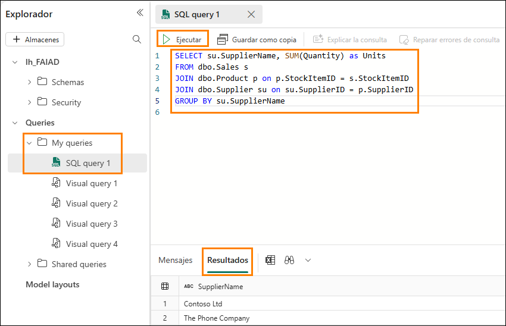

## Tarea 2: visualizar el resultado de T-SQL

1. También podemos visualizar el resultado de esta consulta. **Resalte
    la consulta** en el panel de consulta

2. En el menú del panel Resultados, seleccione **Explorar estos datos
    (versión preliminar) -> Visualización de resultados**.

    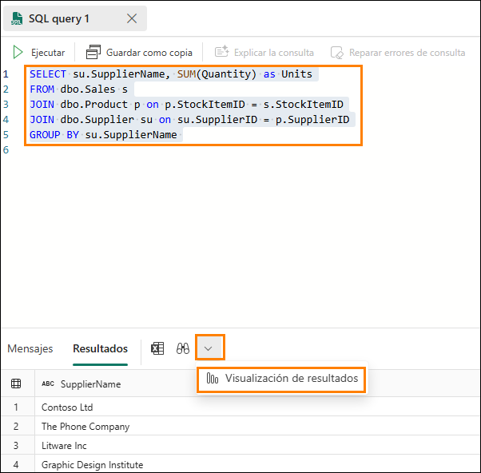

3. Se abrirá el cuadro de diálogo **Visualización de resultados**.
    Seleccione **Continuar**.

    Se abre el cuadro de diálogo **Visualización de resultados** que se
    parece a la vista de informe de Power BI Desktop. Esto tiene todas las
    características disponibles en la vista de informe de Power BI Desktop,
    puede formatear la página, seleccionar diferentes visuales, formatear
    visuales, añadir filtros, etc. No exploraremos estas opciones en este
    curso.

4. Expanda el panel **Datos** y expanda **SQL query 1**.

5. Seleccione los **campos** **Supplier_Name** y **Units**. Se crea un
    objeto visual de tabla.

    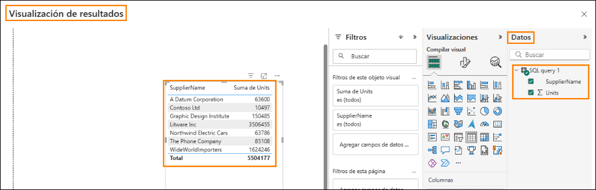

6. En la sección **Visualizaciones**, cambie el tipo de objeto visual
    mediante la selección del **gráfico de Columna apilada**.

7. Seleccione **Guardar como informe** en la parte inferior derecha de
    la pantalla.

    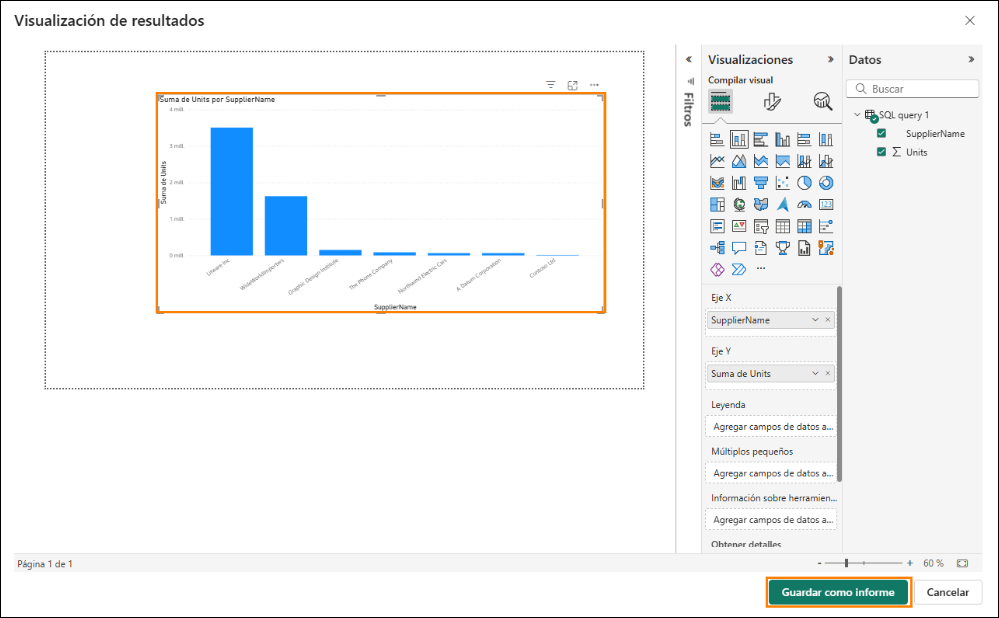

8. Se abre el cuadro de diálogo Guardar el informe. Escriba **Units by
    Supplier** en el cuadro de texto **Especifique un nombre para el
    informe**.

9. Asegúrese de que el área de trabajo de destino es su área de trabajo
    de Fabric **FAIAD_<inject key="Deployment ID" enableCopy="false"/>**

10. Seleccione **Guardar**.

    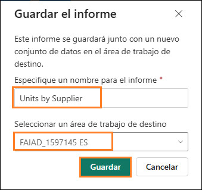

Se le dirigirá de nuevo a la pantalla de consulta SQL.

# Almacén de lago de datos: modelado semántico

## Tarea 3: Crear un modelo semántico

1. Abra el **punto de conexión de análisis SQL** desde su almacén de
    lago de datos.

2. En el panel del explorador, desplácese hacia abajo y seleccione
    **Diseños de modelo**. Verá que el panel central se parece a la
    vista de modelo que veremos en Power BI Desktop.

    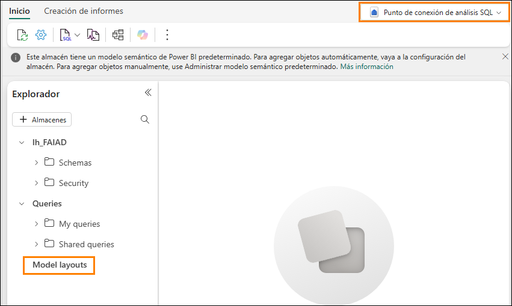

    Este es el modelo predeterminado que crea el almacén de lago de datos.
    Sin embargo, existen algunas limitaciones con el modelo predeterminado
    (como la capacidad de dar formato a medidas, etc.). Además, solo
    necesitamos un subconjunto de las tablas en nuestro modelo. Así que
    crearemos un nuevo modelo semántico.

3. En el menú, **en la parte superior derecha**, seleccione la flecha
    junto al punto de conexión de análisis SQL.

4. Seleccione el **Lakehouse** para navegar a la vista del almacén de
    lago de datos.

    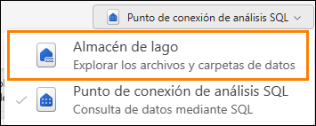

5. En el menú superior, seleccione **Nuevo modelo semántico**.

    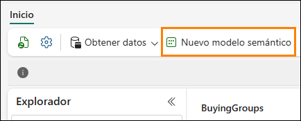

6. Se abre el cuadro de diálogo Nuevo modelo semántico. Escriba
    **sm_FAIAD** como nombre del modelo semántico de Direct Lake.

7. Tenemos la opción de seleccionar un subconjunto de las tablas de
    manera predeterminada. Recuerde que creamos vistas en el laboratorio
    anterior. Queremos incluir estas vistas en el modelo. Expanda el
    esquema **dbo**; desde aquí, puede ver todas las tablas y vistas en
    su almacén de lago de datos.

    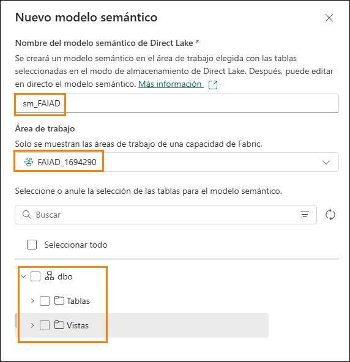

8. **Seleccione** las siguientes tablas/vistas:

    a. **Customer**

    b. **Date**

    c. **People**

    d. **PO**

    e. **Supplier**

    f. **Geo**

    g. **Product**

    h. **Reseller**

    i. **Sales**

9. Seleccione **Confirmar**.

    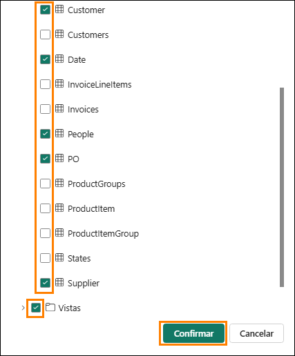

## Tarea 4: Crear relaciones

Navegará al nuevo modelo semántico con las tablas seleccionadas.
Asegúrese de **reorganizar** las tablas según sea necesario. Observe que
algunas de las tablas (Geo, Reseller, Sales y Product) tienen un signo
de advertencia en la parte superior derecha de la tabla. Esto se debe a
que son vistas. Todos los objetos visuales creados con campos de estas
vistas estarán en modo Direct Query y no en modo Direct Lake.

**Nota:** El modo Direct Lake es más rápido que el modo Direct Query.

1. Volvamos al **espacio de trabajo** de Fabric y seleccionemos el
    modelo semántico **sm_FAIAD**.

    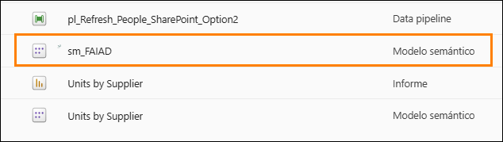

2. Haga clic en **Abrir modelo de datos**.

    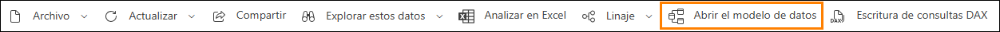

3. En la esquina superior derecha, asegúrese de que se encuentra en el
    modo **Edición**.

    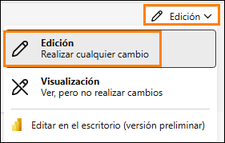

4. El primer paso es crear relaciones entre estas tablas.

    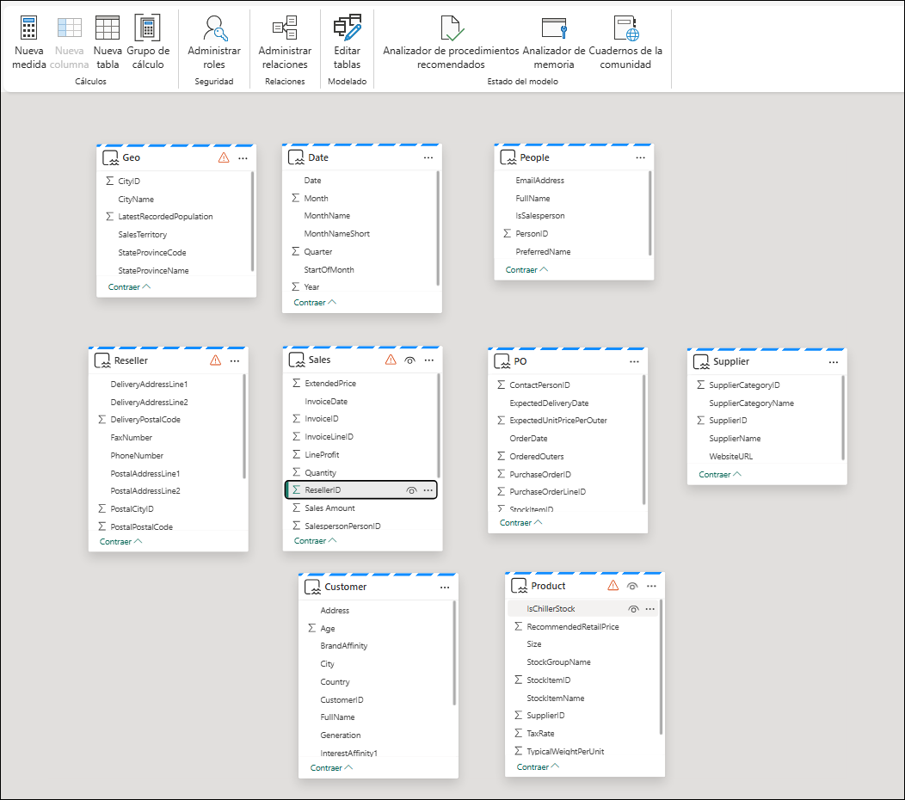

5. Creemos una relación entre las tablas Sales y Reseller. Seleccione
    **ResellerID** de la tabla **Sales** y arrástrelo a **ResellerID**
    en la tabla **Reseller**.

    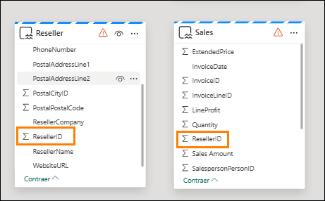

6. Se abre el cuadro de diálogo Nueva relación. Asegúrese de que la
    **Desde la tabla** sea **Sales** y que la **Columna** sea
    **ResellerID**.

7. Asegúrese de que la **A la tabla** sea **Reseller** y que la
    **Columna** sea **ResellerID**.

8. Asegúrese de que la **Cardinality** sea **Varios a uno (*:1)**.

9. Asegúrese de que la **Dirección de filtro cruzado** sea **Único**.

10. Seleccione **Guardar**.

    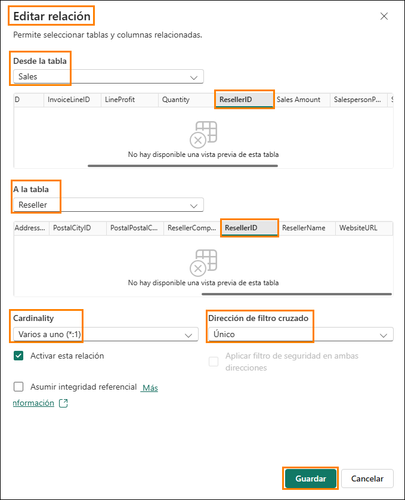

11. De forma similar, creemos una relación entre las tablas Sales y
    Date. Seleccione **InvoiceDate** de la tabla **Sales** y arrástrelo
    a **Date** en la tabla **Date**.

12. Se abre el cuadro de diálogo Nueva relación. Asegúrese de que la
    **Desde la tabla** sea **Sales** y que la **Columna** sea
    **InvoiceDate**.

13. Asegúrese de que la **A la tabla** sea **Date** y que la **Columna**
    sea **Date**.

14. Asegúrese de que la **Cardinality** sea **Varios a uno (*:1)**.

15. Asegúrese de que la **Dirección de filtro cruzado** sea **Único**.

16. Seleccione **Guardar**.

    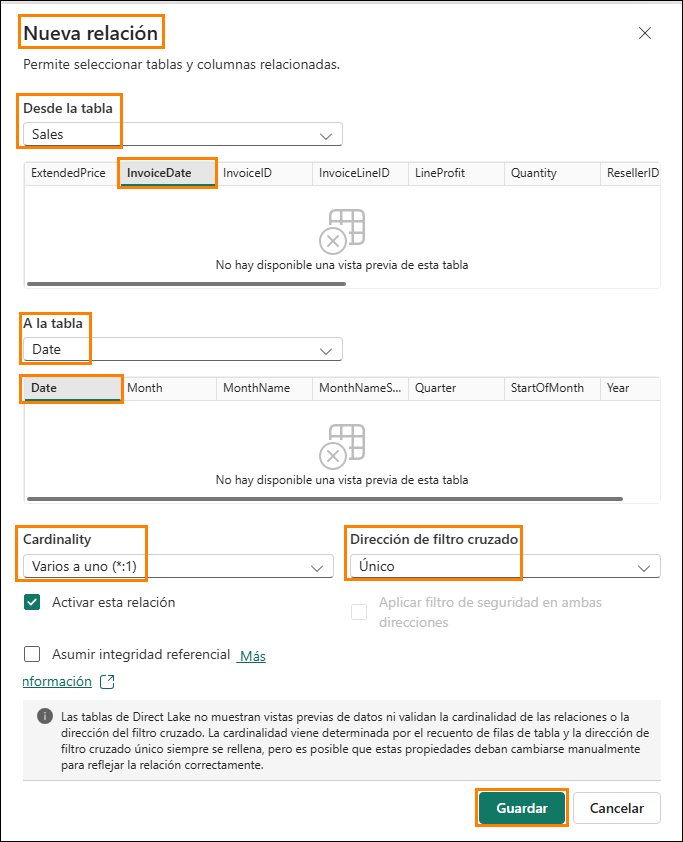

17. De forma similar, cree una relación **varios a uno** entre las
    tablas **Sales** y **Product**. Seleccione **StockItemID** en la
    tabla **Sales** y **StockItemID** en la tabla **Product**.

    **Nota:** Todas nuestras actualizaciones se guardan automáticamente.

    **Punto de control:** su modelo debe tener tres relaciones entre las
    tablas Sales y Reseller, Sales y Date y Sales y Product como se muestra
    en la siguiente captura de pantalla:

    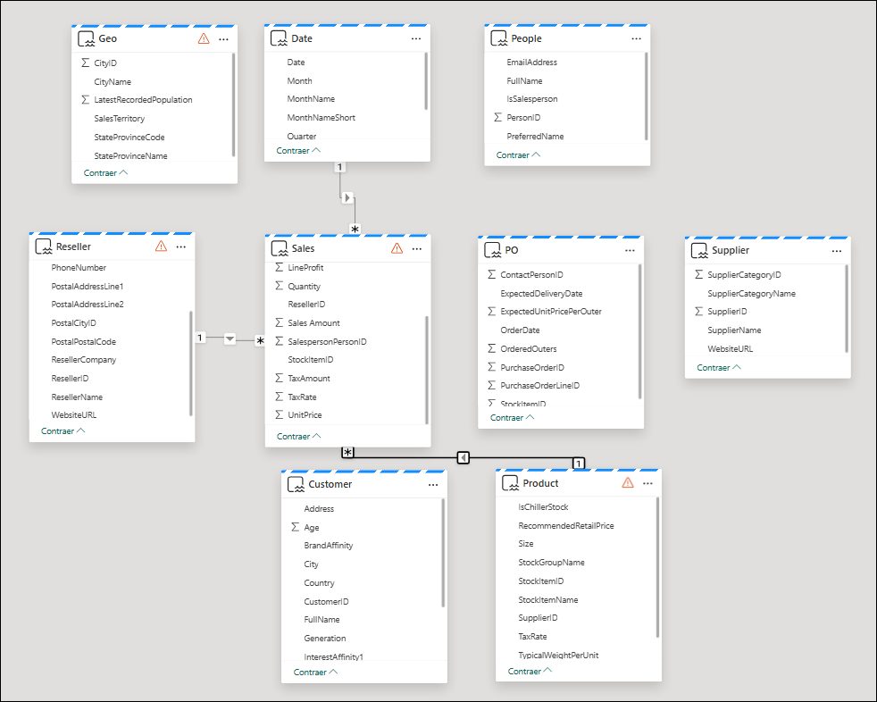

Por razones de tiempo, no crearemos todas las relaciones. Si el tiempo
lo permite, puede completar la sección opcional al final de la práctica
de laboratorio. La sección opcional recorre los pasos para crear las
relaciones restantes.

## Tarea 5: Crear medidas

Agreguemos algunas medidas que necesitamos para crear el panel de Sales.

1. Seleccione la **tabla Sales** desde la vista del modelo. Queremos
    agregar las medidas a la tabla Sales.

2. En el menú superior, seleccione **Inicio -> Nueva medida**. Observe
    que se muestra la barra de fórmulas.

3. Introduzca **Sales = SUM('Sales'[Sales Amount])** en la **barra de
    fórmulas**.

4. Haga clic en la **marca de verificación** izquierda de la barra de
    fórmulas o haga clic en el botón **Enter**.

5. Expanda el panel Propiedades de la derecha.

6. Expanda la sección **Formato**.

7. En el menú desplegable **Formato**, seleccione **Moneda**.

8. Establezca Posiciones decimales en **0**.

    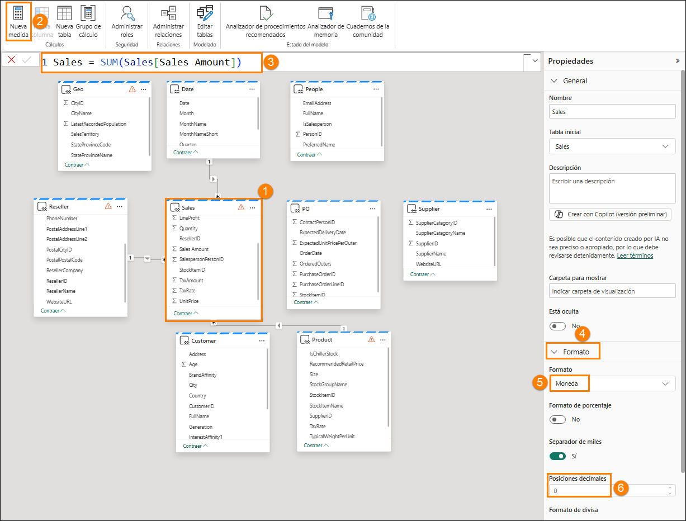

9. Con la **tabla Sales** seleccionada en el menú superior, seleccione
    **Inicio -> Nueva medida**. Observe que se muestra la barra de
    fórmulas.

10. Introduzca **Units = SUM('Sales'[Quantity])** en la **barra de
    fórmulas**.

11. Haga clic en la **marca de verificación** izquierda de la barra de
    fórmulas o haga clic en el botón **Enter**.

12. En el panel Propiedades a la derecha, expanda la sección **Formato**
    (el panel Propiedades puede tardar unos momentos en cargarse).

13. En el menú desplegable **Formato**, seleccione **Número entero**.

14. Utilice el control deslizante para establecer el **Separador de
    miles** en **Sí**.

    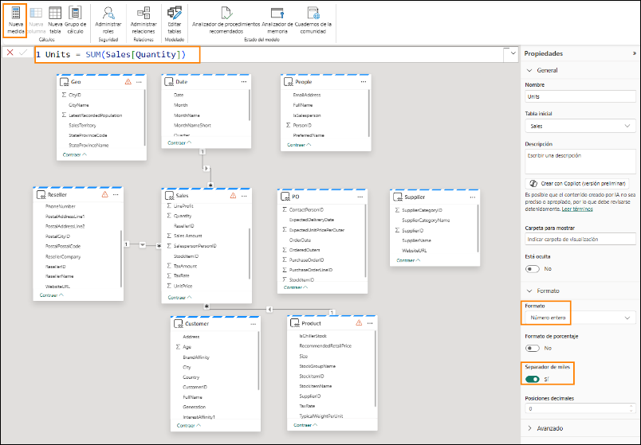

15. Con la **tabla Sales** seleccionada en el menú superior, seleccione
    **Inicio -> Nueva medida**. Observe que se muestra la barra de
    fórmulas.

16. Introduzca **Sales Orders = DISTINCTCOUNT('Sales'[InvoiceID])** en
    la **barra de fórmulas**.

17. Haga clic en la **marca de verificación** izquierda de la barra de
    fórmulas o haga clic en el botón **Enter**.

18. En el panel Propiedades de la derecha, expanda la sección
    **Formato**.

19. En el menú desplegable **Formato**, seleccione **Número entero**.

20. Utilice el control deslizante para establecer el **Separador de
    miles** en **Sí**.

    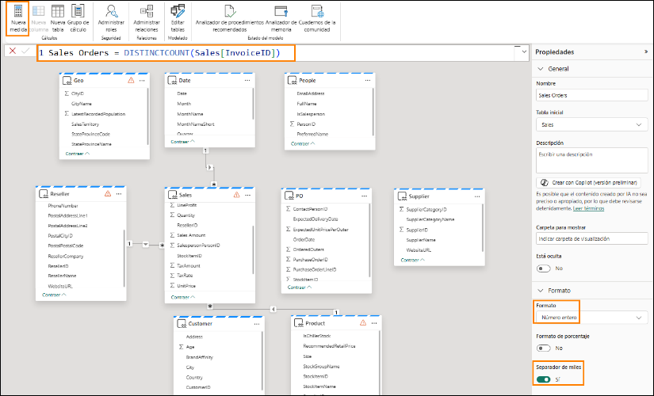

21. En el **Panel de datos** (en la derecha), seleccione **Modelo**.
    Observe que esto proporciona una vista que ayudará a organizar todos
    los elementos del modelo semántico.

22. Expanda **Modelo semántico -> Medidas** para ver todas las medidas
    que acaba de crear.

23. También puede **expandir tablas individuales** para ver las
    columnas, jerarquías y medidas en cada una de ellas.

    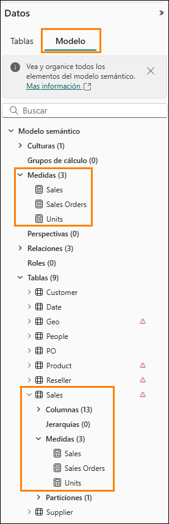

    De nuevo, por razones de tiempo, no crearemos todas las medidas. Si el
    tiempo lo permite, puede completar la sección opcional al final de la
    práctica de laboratorio. La sección opcional recorre los pasos para
    crear las medidas restantes.

Hemos creado un modelo semántico, el siguiente paso es crear un informe.
Lo haremos en el siguiente laboratorio.

## Tarea 6: Sección opcional: crear relaciones

Agreguemos las relaciones restantes.

1. En el menú, seleccione **Inicio -> Administrar relaciones**.

2. Se abre el cuadro de diálogo Administrar relaciones. Seleccione +
    **Nueva relación**.

    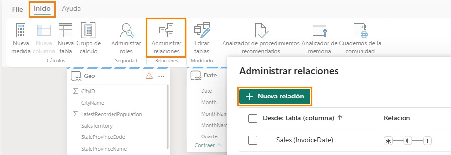

3. Se abre el cuadro de diálogo Nueva relación. Asegúrese de que la
    **Desde la tabla** sea **Sales** y que la **Columna** sea
    **SalespersonPersonID**.

4. Asegúrese de que la **A la tabla** sea **People** y que la
    **Columna** sea **PersonID**.

5. Asegúrese de que la **Cardinality** sea **Varios a uno (*:1)**.

6. Asegúrese de que la **Dirección de filtro cruzado** sea **Único**.

7. Seleccione **Guardar**. Se abre el cuadro de diálogo Administrar
    relaciones con la nueva relación agregada.

    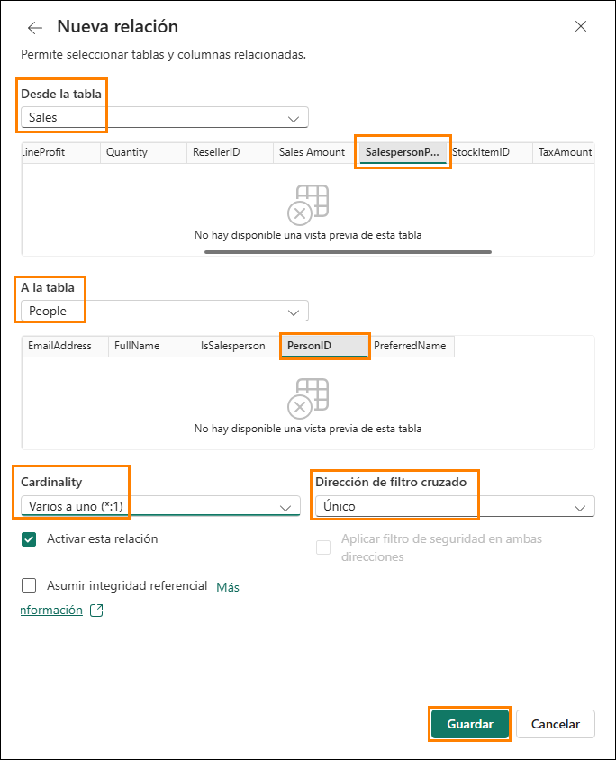

8. Ahora creemos una relación entre las tablas Product y Supplier.
    Seleccione **+ Nueva relación**.

9. Asegúrese de que la **Desde la tabla** sea **Product** y que la
    **Columna** sea **SupplierID**.

10. Asegúrese de que la **A la tabla** sea **Supplier** y que la
    **Columna** sea **SupplierID**.

11. Asegúrese de que la **Cardinality** sea **Varios a uno (*:1)**.

12. Asegúrese de que la **Dirección de filtro cruzado** sea **Ambas**.

13. Seleccione **Guardar**.

    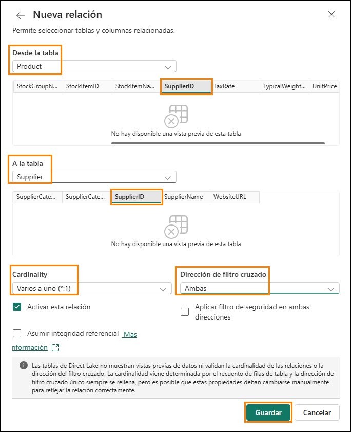

14. Ahora creemos una relación entre las tablas Reseller y Geo.
    Seleccione **+ Nueva relación**.

15. Se abre el cuadro de diálogo Nueva relación. Asegúrese de que la
    **Desde la tabla** sea **Reseller** y que la **Columna** sea
    **PostalCityID**.

16. Asegúrese de que la **A la tabla** sea **Geo** y que la **Columna**
    sea **CityID**.

17. Asegúrese de que la **Cardinality** sea **Varios a uno (*:1)**.

18. Asegúrese de que la **Dirección de filtro cruzado** sea **Ambas**.

19. Seleccione **Guardar**.

    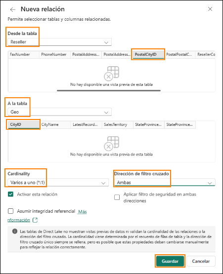

20. Del mismo modo, creamos una relación entre las tablas Customer y
    Reseller. Seleccione **+ Nueva relación**.

21. Se abre el cuadro de diálogo Nueva relación. Asegúrese de que la
    **Desde la tabla** sea **Customer** y que la **Columna** sea
    **ResellerID**.

22. Asegúrese de que la **A la tabla** sea **Reseller** y que la
    **Columna** sea **ResellerID**.

23. Asegúrese de que la **Cardinality** sea **Varios a uno (*:1)**.

24. Asegúrese de que la **Dirección de filtro** **cruzado** sea
    **Único**.

25. Seleccione **Guardar**.

    **Punto de control:** la administración de relaciones debe parecerse al
    de la siguiente captura de pantalla.

    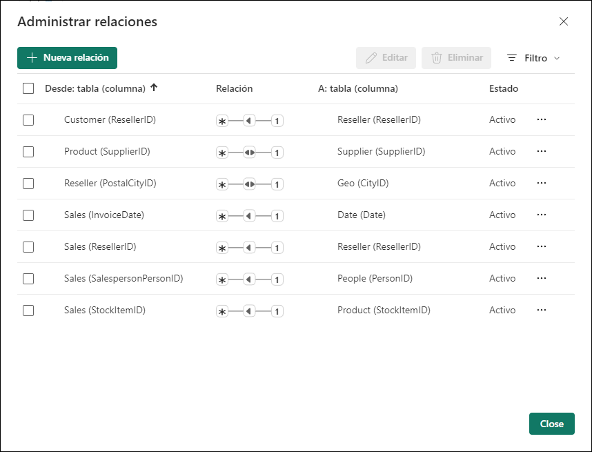

26. Igualmente, cree una relación **varios a uno** entre las tablas
    **PO** y **Date**. Seleccione **Order_Date** de **PO** y **Date** de
    **Date**.

27. Igualmente, cree una relación **varios a uno** entre las tablas
    **PO** y **Product**. Seleccione **StockItemID** de **PO** y
    **StockItemID** de **Product**.

28. Igualmente, cree una relación **varios a uno** entre las tablas
    **PO** y **People**. Seleccione **ContactPersonID** de **PO** y
    **PersonID** de **People**.

29. Haga clic en **Cerrar** para cerrar el cuadro de diálogo Administrar
    relaciones. Hemos terminado de crear todas las relaciones.

    **Punto de control:** su modelo debe parecerse al de la siguiente
    captura de pantalla.

    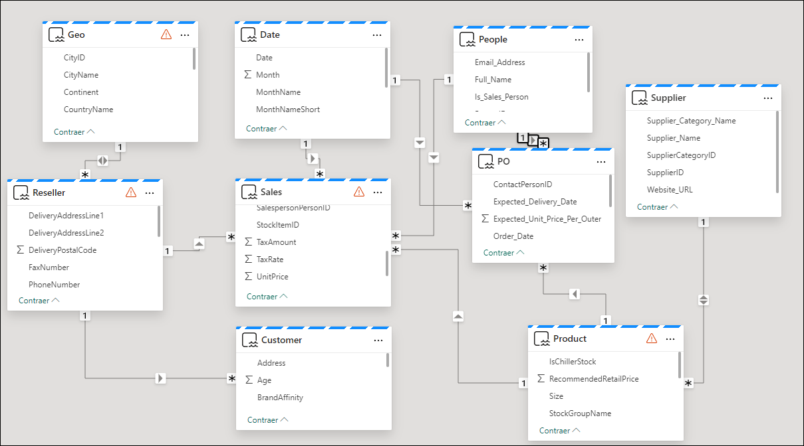

## Tarea 7: Sección opcional: crear medidas

Agreguemos las medidas restantes.

1. Seleccione la tabla **Sales** y en el menú superior, seleccione
    **Inicio -> Nueva medida**.

2. Introduzca **Avg Order = DIVIDE([Sales], [Sales Orders])** en la
    barra de fórmulas.

3. Haga clic en la **marca de verificación** en la barra de fórmulas o
    haga clic en el botón Enter.

4. Expanda el panel Propiedades de la derecha.

5. Expanda la sección **Formato**.

6. En el menú desplegable **Formato**, seleccione **Moneda**.

7. Establezca Posiciones decimales en 0.

    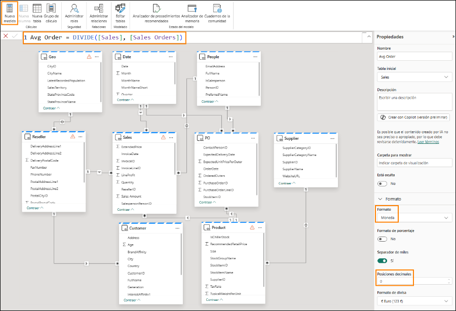

8. Siga pasos similares para agregar las siguientes medidas:

    a. En la tabla **Sales , GM = SUM('Sales'[LineProfit])** formateado como **Divisa con 0 decimales**.

    b. En la tabla **Sales**, **GM% = DIVIDE([GM], [Sales])** formateado como **Porcentaje con 0 decimales**.

    c. En la tabla **Customer, No of Customers = COUNTROWS(Customer)** formateado como **Número entero con separador de miles activado**.

# Referencias

Fabric Analyst in a Day (FAIAD) le presenta algunas funciones clave
disponibles en Microsoft Fabric. En el menú del servicio, la sección
Ayuda (?) tiene vínculos a algunos recursos excelentes.

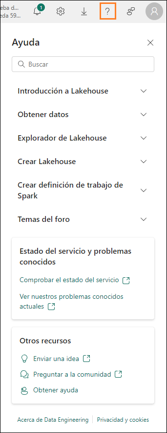

Estos son algunos recursos más que podrán ayudarle a seguir avanzando
con Microsoft Fabric.

- Vea la publicación del blog para leer el [anuncio de disponibilidad
  general de Microsoft Fabric](https://aka.ms/Fabric-Hero-Blog-Ignite23)
  completo.

- Explore Fabric a través de la [Visita
  guiada](https://aka.ms/Fabric-GuidedTour)

- Regístrese en la [prueba gratuita de Microsoft
  Fabric](https://aka.ms/try-fabric)

- Visite el [sitio web de Microsoft
  Fabric](https://aka.ms/microsoft-fabric)

- Adquiera nuevas capacidades mediante la exploración de los [módulos de
  aprendizaje de Fabric](https://aka.ms/learn-fabric)

- Explore la [documentación técnica de
  Fabric](https://aka.ms/fabric-docs)

- Lea el [libro electrónico gratuito sobre cómo empezar a usar
  Fabric](https://aka.ms/fabric-get-started-ebook)

- Únase a la [comunidad de Fabric](https://aka.ms/fabric-community) para
  publicar sus preguntas, compartir sus comentarios y aprender de otros.

Obtenga más información en los blogs de anuncios de la experiencia
Fabric:

- [Experiencia de Data Factory en el blog de
  Fabric](https://aka.ms/Fabric-Data-Factory-Blog) 

- [Experiencia de Synapse Data Engineering en el blog de
  Fabric](https://aka.ms/Fabric-DE-Blog) 

- [Experiencia de Synapse Data Science en el blog de
  Fabric](https://aka.ms/Fabric-DS-Blog) 

- [Experiencia de Synapse Data Warehousing en el blog de
  Fabric](https://aka.ms/Fabric-DW-Blog) 

- [Experiencia de Synapse Real-Time Analytics en el blog de
  Fabric](https://aka.ms/Fabric-RTA-Blog)

- [Blog de anuncios de Power BI](https://aka.ms/Fabric-PBI-Blog)

- [Experiencia de Data Activator en el blog de
  Fabric](https://aka.ms/Fabric-DA-Blog) 

- [Administración y gobernanza en el blog de
  Fabric](https://aka.ms/Fabric-Admin-Gov-Blog)

- [OneLake en el blog de Fabric](https://aka.ms/Fabric-OneLake-Blog)

- [Blog de integración de Dataverse y Microsoft
  Fabric](https://aka.ms/Dataverse-Fabric-Blog)

© 2025 Microsoft Corporation. Alle Rechte vorbehalten.

Durch die Verwendung der vorliegenden Demo/Übung stimmen Sie den
folgenden Bedingungen zu:

Die in dieser Demo/Übung beschriebene Technologie/Funktionalität wird
von der Microsoft Corporation bereitgestellt, um Feedback von Ihnen zu
erhalten und Ihnen Wissen zu vermitteln. Sie dürfen die Demo/Übung nur
verwenden, um derartige Technologiefeatures und Funktionen zu bewerten
und Microsoft Feedback zu geben. Es ist Ihnen nicht erlaubt, sie für
andere Zwecke zu verwenden. Es ist Ihnen nicht gestattet, diese
Demo/Übung oder einen Teil derselben zu ändern, zu kopieren, zu
verbreiten, zu übertragen, anzuzeigen, auszuführen, zu
vervielfältigen, zu veröffentlichen, zu lizenzieren, zu transferieren
oder zu verkaufen oder aus ihr abgeleitete Werke zu erstellen.

DAS KOPIEREN ODER VERVIELFÄLTIGEN DER DEMO/ÜBUNG (ODER EINES TEILS
DERSELBEN) AUF EINEN/EINEM ANDEREN SERVER ODER SPEICHERORT FÜR DIE
WEITERE VERVIELFÄLTIGUNG ODER VERBREITUNG IST AUSDRÜCKLICH UNTERSAGT.

DIESE DEMO/ÜBUNG STELLT BESTIMMTE
SOFTWARE-TECHNOLOGIE-/PRODUKTFEATURES UND FUNKTIONEN, EINSCHLIESSLICH
POTENZIELLER NEUER FEATURES UND KONZEPTE, IN EINER SIMULIERTEN
UMGEBUNG OHNE KOMPLEXE EINRICHTUNG ODER INSTALLATION FÜR DEN OBEN
BESCHRIEBENEN ZWECK BEREIT. DIE TECHNOLOGIE/KONZEPTE IN DIESER
DEMO/ÜBUNG ZEIGEN MÖGLICHERWEISE NICHT DAS VOLLSTÄNDIGE
FUNKTIONSSPEKTRUM UND FUNKTIONIEREN MÖGLICHERWEISE NICHT WIE DIE
ENDGÜLTIGE VERSION. UNTER UMSTÄNDEN VERÖFFENTLICHEN WIR AUCH KEINE
ENDGÜLTIGE VERSION DERARTIGER FEATURES ODER KONZEPTE. IHRE ERFAHRUNG
BEI DER VERWENDUNG DERARTIGER FEATURES UND FUNKTIONEN IN EINER
PHYSISCHEN UMGEBUNG KANN FERNER ABWEICHEND SEIN.

**FEEDBACK**. Wenn Sie Feedback zu den Technologiefeatures, Funktionen
und/oder Konzepten geben, die in dieser Demo/Übung beschrieben werden,
gewähren Sie Microsoft das Recht, Ihr Feedback in jeglicher Weise und
für jeglichen Zweck kostenlos zu verwenden, zu veröffentlichen und
gewerblich zu nutzen. Außerdem treten Sie Dritten kostenlos sämtliche
Patentrechte ab, die erforderlich sind, damit deren Produkte,
Technologien und Dienste bestimmte Teile einer Software oder eines
Dienstes von Microsoft, welche/welcher das Feedback enthält, verwenden
oder eine Verbindung zu dieser/diesem herstellen können. Sie geben
kein Feedback, das einem Lizenzvertrag unterliegt, aufgrund dessen
Microsoft Drittparteien eine Lizenz für seine Software oder
Dokumentation gewähren muss, weil wir Ihr Feedback in diese aufnehmen.
Diese Rechte bestehen nach Ablauf dieser Vereinbarung fort.

DIE MICROSOFT CORPORATION LEHNT HIERMIT JEGLICHE GEWÄHRLEISTUNGEN UND
GARANTIEN IN BEZUG AUF DIE DEMO/ÜBUNG AB, EINSCHLIESSLICH ALLER
AUSDRÜCKLICHEN, KONKLUDENTEN ODER GESETZLICHEN GEWÄHRLEISTUNGEN UND
GARANTIEN DER HANDELSÜBLICHKEIT, DER EIGNUNG FÜR EINEN BESTIMMTEN
ZWECK, DES RECHTSANSPRUCHS UND DER NICHTVERLETZUNG VON RECHTEN
DRITTER. MICROSOFT MACHT KEINERLEI ZUSICHERUNGEN BZW. ERHEBT KEINERLEI
ANSPRÜCHE IM HINBLICK AUF DIE RICHTIGKEIT DER ERGEBNISSE UND DES AUS
DER VERWENDUNG DER DEMO/ÜBUNG RESULTIERENDEN ARBEITSERGEBNISSES BZW.
BEZÜGLICH DER EIGNUNG DER IN DER DEMO/ÜBUNG ENTHALTENEN INFORMATIONEN
FÜR EINEN BESTIMMTEN ZWECK.

**HAFTUNGSAUSSCHLUSS**

Diese Demo/Übung enthält nur einen Teil der neuen Features und
Verbesserungen in Microsoft Power BI. Einige Features können sich
unter Umständen in zukünftigen Versionen des Produkts ändern. In
dieser Demo/Übung erhalten Sie Informationen über einige, aber nicht
über alle neuen Features.